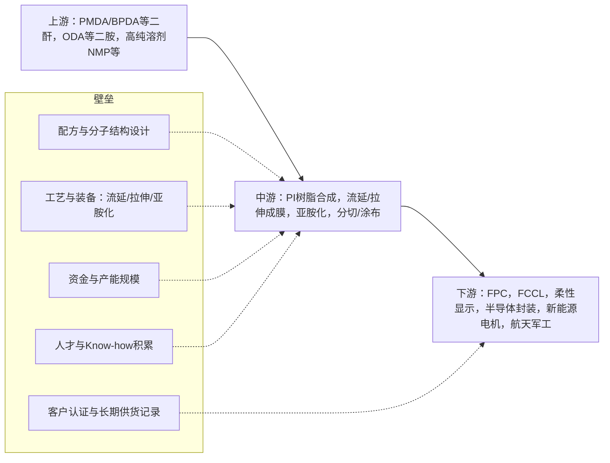

PI薄膜是典型“金字塔尖”的高性能材料，全球高端电子级/航天级长期被美日韩少数巨头垄断，国内在电工级等中低端已基本自给，但在高端电子级、CPI、PSPI等仍国产化率偏低（普遍<20%），行业集中度高、技术与资金壁垒极强。竞争的核心是：配方+工艺+装备+客户认证的系统性壁垒，而不是单一环节。上下游呈“石化单体→PI树脂/薄膜→FPC/显示/半导体/新能源/航天”链条，中游议价能力偏弱，但高端环节正在国产替代加速。
下面按你关心的三个问题展开：行业格局、竞争与壁垒、产业链。
---
## 一、行业格局：谁在玩、怎么分层
### 1. 全球格局：高端寡头垄断，中低端逐步扩散
- 全球高端PI薄膜市场基本由美、日、韩企业主导，CR3/CR5常在70–80%以上。典型代表：
  - 美国杜邦（Kapton系列）
  - 日本钟渊化学（Kaneka，Apical系列）
  - 日本宇部兴产（Upilex）
  - 韩国SKC / PIAM（原SKPI，扩张很快）
  - 日本东丽等
- 这些企业产能普遍在2000–5000吨/年量级，掌握了：
  - 超薄（<10μm甚至5μm）、低介电常数（Dk<3.0）、高导热、耐电晕等高端电子级产品
  - 透明聚酰亚胺（CPI）、光敏聚酰亚胺（PSPI）等新形态
  - 大量核心专利与长期客户绑定
- 中国是最大增量市场：全球PI膜消费中，中国占比约40–45%，且增速最快。
### 2. 国内格局：低端自给，高端替代加速
- 整体产能与规模：
  - 2016–2022年中国PI膜产能从约6580吨增至11431吨，2023年估计突破1.2万吨。
  - 2020–2024年国内PI膜产能从约3200吨/年提升到6500吨/年，自给率由不足40%提升到60%以上。
  - 2022年国内PI膜市场规模约72.4亿元，预计2025年接近100亿元。
- 产品结构：
  - 电工级PI膜（耐温180–200℃）：国内已基本实现国产自给，竞争较激烈，同质化明显。
  - 电子级PI膜（FPC、柔性显示、5G等）：国产化率不足15–20%，是国产替代主战场。
  - 特种/航天级、CPI、PSPI：国产化率更低，部分领域几乎空白。
- 国内主要玩家（按类型）：
  - 高性能PI膜龙头：
    - 瑞华泰：国内高性能PI薄膜龙头，全球市占率约5–6%，掌握“化学亚胺化+流涎拉伸”双工艺，产品覆盖热控、电子、电工、航天等，是华为折叠屏CPI膜独家供应商，已进入苹果、中芯国际等供应链。
    - 时代新材 / 时代华鑫：市占率约19.5–25%，高端PI膜产能约500吨，规划扩至3000吨，是国内首条化学亚胺法PI膜生产线企业，重点突破高端电子、轨道交通等。
    - 国风新材：PI膜是核心转型方向，芯片封装用PI膜产能约1500吨，产品覆盖FPC、半导体封装、覆铜PI基膜等，客户包括宁德时代、京东方等。
  - 功能/细分领域：
    - 鼎龙股份：国内PSPI（光敏聚酰亚胺）龙头，面板YPI/PSPI第一供应商，国产PSPI市占率约60%，替代日系产品。
    - 万润股份：国内唯一量产热塑性TPI树脂的企业，OLED用PSPI在验证阶段，布局航天、光纤等高端应用。
    - 泰和新材：PI膜侧重新能源汽车导热膜、电机绝缘等。
    - 丹邦科技、达迈科技、山东万达微电子等：专注电子级PI膜、FPC基膜等。
- 市场集中度：
  - 全球高端CR3>70%，国内中高端也在向瑞华泰、时代新材、国风新材等头部集中，但整体仍“多而弱”：国内有70–80家PI膜企业，大部分百吨级产能，集中在电工级中低端。
---
## 二、竞争格局与核心壁垒：为什么“难做”
先用一张简化的结构图，把壁垒放在产业链里看：

### 1. 竞争格局的关键特征
1）分层竞争：  
- 低端电工级：价格竞争为主，同质化严重，毛利率偏低；国内企业众多，产能分散。  
- 高端电子级/特种级：技术+认证壁垒极高，玩家少，毛利率高（22–38%区间，超薄/特种更高），价格可达普通绝缘材料的10倍以上。
2）区域与供应链安全：  
- 中美贸易摩擦、反垄断调查（如对杜邦PI膜反垄断调查）加速国产替代意愿。  
- 下游大厂（华为、苹果、中车、宁德时代等）为保供应链安全，主动扶持本土供应商，但认证周期长、要求严。
3）国产替代节奏：  
- 电工级：已完成国产替代，出口部分中低端。  
- 电子级：正在加速，国产化率从不足20%向30–40%迈进。  
- CPI/PSPI/航天级：起步阶段，技术空白多，是未来5–10年的重点攻坚方向。
### 2. 核心壁垒拆解
#### （1）技术壁垒：配方+工艺+装备“三座大山”
- 配方与分子结构设计：
  - 高端PI膜要求同时满足：耐高温、高绝缘、低介电常数、低热膨胀系数（CTE）、高尺寸稳定性、耐辐照等，需要从二酐/二胺结构、共聚比例、添加剂等方面系统设计。
  - 透明CPI、PSPI等功能化PI膜，对分子结构设计要求更高，目前仅少数日韩企业掌握量产技术。
- 工艺难点：
  - 亚胺化工艺：热亚胺法简单但难以做高端；化学亚胺法性能更优但配方复杂、设备投入大，国内仅少数企业掌握。
  - 超薄化与厚度均匀性：电子级PI膜厚度常在12.5μm以下，偏差要求≤±1%，否则FPC等后续加工良率大幅下降。
  - 双向拉伸工艺：通过拉伸提高强度和尺寸稳定性，但高温拉伸下分子取向控制难度大，易牺牲耐温性。
- 装备依赖：
  - 高精度流延线、双向拉伸机组、高温亚胺化炉等核心设备长期依赖海外定制，采购周期18–24个月，且对工艺理解要求极高。
  - 设备一旦投用，工艺路线基本“锁定”，切换成本巨大，这也是为什么扩产非常谨慎。
#### （2）客户认证与供货记录壁垒
- 下游高端客户（FPC厂、面板厂、半导体封装厂、轨交/航天整机厂）对材料要求极其苛刻：
  - 认证周期长：小试→中试→量产通常2–3年甚至更久。
  - 需要长期供货记录：同一型号连续多批次稳定交付，才敢在大项目中采用。
  - 一旦进入供应链，不会轻易更换供应商，形成“先发者优势+客户锁定”。
- 结果：新进入者即使有技术，也面临“有产能无订单”的困境，而头部企业则产能越滚越大。
#### （3）资金与规模壁垒
- 单线投资高：千吨级高端PI膜产线投资往往数亿人民币，且设备定制周期长，扩产决策需要很强前瞻性。
- 产能规模影响议价与研发：
  - 产能太小，大客户不敢把大订单给你（几百吨需求无法被分散供应商满足）。
  - 产线要兼顾生产与研发，产能不足时，新产品试制空间有限，技术迭代慢。
#### （4）人才与Know-how壁垒
- PI膜涉及高分子合成、精细化工、薄膜加工、设备控制等多学科，高端人才稀缺。
- 工艺know-how多为隐性知识，靠长期试错积累，难以通过图纸/专利简单复制。
- 这也是为什么很多企业即便买来设备，也难以稳定做出高端产品。
#### （5）原料与环保壁垒
- 上游单体（如高纯PMDA、BPDA、ODA）和溶剂（NMP等）长期部分依赖进口，价格波动大，影响成本与稳定性。
- 生产过程中使用大量强极性溶剂，回收难度大，环保处理成本占生产成本20%以上，环保趋严抬高合规门槛。
---
## 三、上下游产业链：从哪里来、到哪里去
### 1. 产业链总览
- 上游：核心原料与装备
  - 核心单体：均苯四甲酸二酐（PMDA）、联苯四甲酸二酐（BPDA）、4,4'-二氨基二苯醚（ODA）等芳香族二酐/二胺。
  - 溶剂：NMP、DMAC等强极性溶剂，用于溶液缩聚和流延成膜。
  - 功能添加剂：无机填料、偶联剂等，用于改性（导热、低CTE、耐电晕等）。
  - 关键设备：高精度流延机、双向拉伸机组、亚胺化炉、分切/涂布线等。
- 中游：PI薄膜制造
  - 树脂合成：二酐+二胺在溶剂中缩聚，形成聚酰胺酸溶液（PAA）。
  - 成膜：流延（或拉伸）成膜，随后进行（化学/热）亚胺化，形成PI薄膜。
  - 后处理：表面处理、涂布、分切、卷绕等，按不同应用定制。
- 下游：主要应用领域
  - 柔性印刷电路板（FPC） / 柔性覆铜板（FCCL）：最大下游，约占PI膜需求48–61%。
  - 柔性显示（OLED/AMOLED）：基板材料、盖板CPI、触控传感器等。
  - 半导体封装与光刻：PSPI作缓冲层/钝化层/光刻胶，RDL层、再布线层等。
  - 热控/散热：高导热PI膜作为石墨散热膜前驱体，用于手机、服务器、5G基站等。
  - 电机/发电机绝缘：耐电晕PI膜用于变频电机、高铁牵引电机、风电电机等。
  - 电线电缆、电磁线、变压器绝缘。
  - 航空航天：卫星太阳能电池基板、热控/防护材料、线缆绝缘等。
  - 新能源汽车：电池绝缘/隔膜、电机绝缘、BMS用FPC等。
### 2. 上游：原料与装备的“卡点”
- 单体：
  - 普通PMDA/ODA国产化率已较高，但高纯度、特种二酐/二胺仍部分依赖进口。
  - 单体价格波动直接传导至PI膜成本，高端产品对单体纯度与一致性要求极高。
- 溶剂与环保：
  - NMP等溶剂回收难度大，环保投入高，小厂在经济上难以承受。
- 设备：
  - 高端流延/拉伸设备主要来自日欧，定制周期长，维护与改造依赖原厂，形成隐性壁垒。
### 3. 下游：谁在真正“买单”
- FPC/FCCL：消费电子（手机、可穿戴）、笔记本、工控医疗等，是PI膜最大的基本盘。
- 柔性显示：折叠屏手机、柔性OLED面板，对CPI/超薄PI膜需求快速增长。
- 5G/AI服务器：高导热PI膜、MPI（改性PI）用于高速互连和散热，单机PI膜用量成倍提升。
- 新能源车与轨交：耐电晕PI膜、电池绝缘膜等，要求高可靠性与长寿命。
- 半导体先进封装：PSPI、低介电PI膜用于RDL、钝化层等，门槛极高。
- 航天军工：航天级PI膜要求耐辐照、低挥发、宽温域，国产化率仍低，是未来重点。
---
## 四、总结：机会与风险
- 机会：
  - 国产替代+供应链安全：政策与市场双驱动，高端PI膜国产化率有较大提升空间。
  - 新需求爆发：5G、AI服务器、折叠屏、新能源车、商业航天等，带来结构性增量。
  - 头部企业受益：技术领先+产能规模+客户认证的先发优势，会不断强化护城河。
- 风险：
  - 技术迭代快：超薄化、低Dk、高导热、CPI/PSPI等方向，若跟不上国际节奏，可能再次被拉开差距。
  - 产能无序扩张：中低端电工级已出现价格战，若高端扩产过快、需求不及预期，可能出现结构性过剩。
  - 原料与设备“卡脖子”：单体纯度、关键设备仍受制于人，成本与供应存在不确定性。
如果你后续是从投资或产业进入角度细看，可以进一步聚焦到：  
- 电子级/特种PI膜 vs 电工级PI膜的投资价值差异；  
- 单一产品（如CPI、PSPI、耐电晕膜）的技术路径与竞争格局；  
- 以及具体企业的产能布局、客户结构和专利情况。
