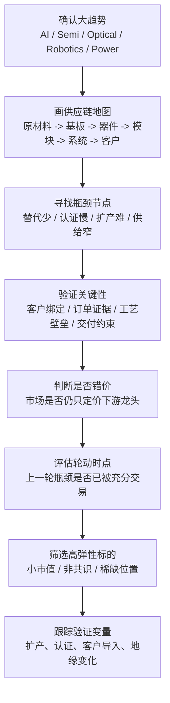

# Serenity（@aleabitoreddit）投资核心框架研究笔记

更新时间：2026-06-23  
整理范围：基于 Serenity 本人的 X 原帖、X Article、Substack 长文，以及公开可访问的主页/归档页面。  
说明：本文中的“框架总结”是基于一手内容做的归纳，不代表逐字原话；“来源”部分尽量只列本人发布内容或可直接指向本人内容的入口。

## 一句话概括

Serenity 的投资方法，不是先找最热的 AI 龙头，而是先沿着 AI、半导体、光通信、机器人等产业链画出完整供需地图，再定位最稀缺、最难替代、最容易成为扩产瓶颈的节点，最后在市场充分认识之前下注这些“卡脖子环节”的高弹性标的。

## 他的核心投资命题

Serenity 的研究主线可以概括为四个词：

- `AI capex`：先确认真正发生的大级别资本开支浪潮
- `Supply chain mapping`：把上下游和客户关系尽可能还原出来
- `Chokepoint`：寻找供给最窄、认证最慢、替代最少的节点
- `Re-rating`：判断市场何时会从讲大故事，转向为具体瓶颈付估值

换句话说，他研究的不是“行业会不会涨”，而是：

1. 哪个赛道真的在扩产
2. 扩产卡在哪个环节
3. 谁是那个关键环节的真正受益者
4. 市场有没有还没把这件事价格化

## 详细方法论

## 1. 从大趋势而不是从个股出发

他的起点通常不是“这家公司便宜不便宜”，而是“哪里正在发生不可逆的需求增长”。从公开内容看，这些大趋势主要包括：

- AI 数据中心与 hyperscaler 资本开支
- 光模块、CPO、Photonics、外部激光器链条
- 半导体材料与基板约束
- 机器人硬件与 physical AI
- 电力、能源、数据中心基础设施

这一步的重点不是预测宏观，而是确认增量资本到底会流向哪些物理系统。

## 2. 用供应链映射替代传统赛道叙事

Serenity 最显著的特征，是会把一个热门方向拆成非常具体的链条：

- 原材料
- 基板/衬底
- 器件
- 封装
- 模块
- 系统集成
- 最终客户

他会尽量追踪：

- 供应商和客户的绑定关系
- 单一来源或寡头来源情况
- 认证周期是否漫长
- 替代品是否真实可用
- 扩产周期和良率爬坡是否困难

这让他的研究更像“产业链工程分析”，而不是纯财务分析。

## 3. 识别真正的 chokepoint / bottleneck

这是他的核心方法论。所谓瓶颈，不只是“重要”，而是同时满足以下特征中的多项：

- 需求上升时，供给不能同步释放
- 行业内替代者少
- 客户切换成本高
- 需要认证或设计导入，替换速度慢
- 扩产难度高，良率、资本开支或工艺壁垒明显
- 市场注意力主要还停留在下游大票，没有给上游瓶颈足够估值

因此他的研究不是追“谁受益”，而是追“谁最卡住系统”。

## 4. 判断“瓶颈轮动”

Serenity 有一个很重要的隐含框架：AI 基建不是只有一个瓶颈，而是会阶段性轮动。

典型轮动逻辑可以表示为：

- 第一阶段：市场先炒最显性的计算资源，如 GPU 和算力
- 第二阶段：资金关注内存、HBM、先进封装等第二层约束
- 第三阶段：再往外转向 networking、optical、laser、材料和基板
- 第四阶段：如果再继续扩张，可能轮到供电、散热、土建、机器人自动化等外围基础设施

他本质上是在判断：当旧瓶颈被市场充分理解后，下一处新增约束会出现在哪里。

## 5. 偏爱“非共识的小而关键”

从他反复提到的标的风格看，他经常更偏好：

- 市值不大
- 关注度不高
- 但在关键环节占据独特位置
- 一旦被主流资金理解，估值弹性会明显大于龙头

这是一种典型的“结构性供给稀缺”打法，而不是传统大盘成长股打法。

## 6. 把地缘政治视作供给变量

在 Serenity 的视角里，地缘政治不只是背景，而是可以直接改变供需结构的硬变量。例如：

- 某种上游材料是否被少数地区垄断
- 某些制造能力是否集中于特定国家
- 出口管制、关税、制裁是否会抬高替代成本
- 某个国家在机器人或硬件链条上是否拥有“断供开关”

这使他的研究兼具产业链研究和地缘风险研究的特征。

## 7. 估值不是起点，而是验证后的放大器

他通常不会先从 PE、PS 开始，而是先确认产业链位置和稀缺性。只有在“关键性成立”后，估值弹性才有意义。

这意味着他的逻辑顺序通常是：

`大趋势 -> 链条拆解 -> 瓶颈确认 -> 客户验证 -> 市场错价 -> 估值重估`

而不是：

`便宜 -> 买入 -> 等反弹`

## 投资框架流程图

## 可操作化版本：如果按他的思路做研究

可以把他的框架落成下面这套检查表：

### 第一步：先定义“增量资本要去哪里”

关注：

- hyperscaler 的资本开支方向
- AI 训练与推理架构演进
- 机器人、自动化、电力系统的新增需求
- 这些需求是否会形成持续扩产，而不是一次性主题炒作

### 第二步：把赛道拆成最细的关键节点

例如研究光通信，不要停在“光模块受益”，而要继续往上拆：

- 激光器
- InP 衬底/基板
- 外部光源
- 光引擎
- 封装
- 模块厂
- 系统厂
- 云厂商

### 第三步：从“重要”升级到“不可替代”

问几个关键问题：

- 这个节点如果缺货，会不会拖慢整个系统交付？
- 替代供应商是否真的存在，还是理论存在？
- 替代需要多长时间？
- 新玩家扩产需要几年还是几个月？
- 是不是存在工艺、良率或客户认证门槛？

### 第四步：找市场还没反应过来的错配

观察是否存在：

- 下游龙头已经大涨
- 上游瓶颈公司还很冷门
- 市场把它当普通零部件公司看待
- 但它实际是整个扩产链中最紧的一个环节

### 第五步：等待“认知扩散”

这类投资的关键不只是逻辑对不对，还包括：

- 什么时候 sell-side / buy-side 开始集体讨论
- 什么时候客户关系被更多人看到
- 什么时候“行业故事”变成“具体瓶颈故事”

很多时候，重估发生在市场从泛行业叙事转向具体供给约束叙事的那一刻。

## 经典案例

以下案例均以 Serenity 本人公开内容为核心线索，总结的是他的研究方向和框架应用，不代表对个股未来表现做判断。

## 案例 1：Sivers Semi（SIVE）与 CPO / 外部激光器瓶颈

### 主题

在 AI 光互连和 CPO 叙事下，Serenity 把关注点放到更上游的激光器供应链，试图证明外部激光器是容易被市场忽略的瓶颈。

### 他的典型思路

- 不满足于“CPO 会增长”这个结论
- 继续往上游追到 laser supplier
- 做客户和合作伙伴映射
- 论证该公司在未来光互连架构中的关键位置
- 关注市场是否还没有把这类上游位置充分价格化

### 这个案例体现了什么框架

- 主题不是买最热的光模块龙头
- 而是买“下游故事成立后，上游最稀缺的受益者”
- 这是 Serenity 最典型的 `chokepoint investing`

### 相关来源

- [Substack: Sivers: The Undiscovered CPO Laser Chokepoint + Customer Mapping](https://aleabitoreddit.substack.com/p/sivers-semi-sive-the-cpo-laser-supplier)

## 案例 2：AXTI / InP Substrates 与材料基板瓶颈

### 主题

Serenity 反复把 InP substrates 作为 AI 光通信链条里的关键上游材料节点来讨论，强调它不是普通原材料，而是可能限制更下游光器件放量的瓶颈之一。

### 他的典型思路

- 市场热衷讨论光模块和网络资本开支
- 他把研究进一步上推到 InP 材料/基板
- 强调供给集中、扩产不容易、下游依赖度高
- 判断市场是否低估了最上游的约束力

### 这个案例体现了什么框架

- 从“器件叙事”继续上探到“材料叙事”
- 找到最不显眼、但可能最卡脖子的层级
- 体现出他非常偏爱上游供给稀缺环节

### 相关来源

- [X: AXTI / InP substrate shortage](https://x.com/aleabitoreddit/status/2004936335702753729)
- [X: InP substrate shortage and spread arbitrage](https://x.com/aleabitoreddit/status/2007202015940931878)

## 案例 3：Win Semi 与 AI / 光通信 / 先进制造承接

### 主题

Serenity 对 Win Semi 的讨论，延续了他一贯的“供应链错位定价”逻辑，即从终端扩产趋势往回找谁在制造能力、器件代工或关键承接环节里最有可能受益。

### 他的典型思路

- 先看到 AI 和 hyperscaler 相关需求外溢
- 再看谁能承接关键器件制造能力
- 判断这些公司是否在不同热门叙事之间同时受益，但市场尚未充分识别

### 这个案例体现了什么框架

- 不是单点看故事
- 而是看一家公司是否同时位于多个增量链条交汇点
- 这本质上是在找“多主题共享的稀缺产能”

### 相关来源

- [X: Win Semi and hyperscaler-related supply chain discussion](https://x.com/aleabitoreddit/status/2041701156771262789)

## 案例 4：Robotics 与“中国硬件供应链 kill switch”

### 主题

在机器人领域，Serenity 的切入点不是简单说“机器人会很大”，而是强调美国机器人硬件链条在关键材料、零部件、产能和供应深度上，可能仍受制于中国。

### 他的典型思路

- 先承认 physical AI / robotics 是长期大趋势
- 再拆开机器人硬件链条
- 找到真正拥有制造深度和成本优势的地区与环节
- 进而提出“谁拥有 supply chain leverage”

### 这个案例体现了什么框架

- 地缘政治不是附属变量，而是核心供给变量
- 供给控制权本身可以成为投资研究的第一性原理
- 这类研究更接近“产业安全视角下的投资框架”

### 相关来源

- [X Article: America is losing the Robotics Race to China](https://x.com/aleabitoreddit/article/2033155882809479239)
- [X: China has a kill switch over US robotic hardware supply chains](https://x.com/aleabitoreddit/status/2033665621356122611)

## 案例 5：AI 基建中的“瓶颈轮动”

### 主题

Serenity 不是只研究单个公司，也研究资金如何围绕 AI 基建约束逐层迁移。他公开提到过类似“institutional bottleneck rotation”的思路，即机构会围绕 AI 基建里不断变化的约束点做轮动。

### 他的典型思路

- 先从最确定的 GPU 和计算资源开始
- 再转向 memory / HBM / packaging
- 然后转向 networking / optical / laser / materials
- 最终把目光放到更边缘、但更稀缺的节点

### 这个案例体现了什么框架

- 他不仅研究“哪些公司会涨”
- 还研究“市场下一步会把注意力迁移到哪里”
- 这让他的框架带有明显的时序交易特征

### 相关来源

- [X: institutional bottleneck rotation](https://x.com/aleabitoreddit/status/2038440978777034988)

## 他的框架与传统成长股研究的差别

和常见的成长股研究相比，Serenity 的差异主要在这里：

- 传统成长研究常从收入、利润、估值出发
- Serenity 更常从物理瓶颈和产业链结构出发
- 传统研究偏重行业景气和竞争格局
- Serenity 更强调“谁卡住了系统”
- 传统研究喜欢龙头确定性
- Serenity 更偏好小而关键、尚未共识的高弹性节点

因此，他的方法更适合：

- 技术路径变化快的产业
- 供给侧壁垒高的产业
- 资本开支扩张明显的产业
- 市场注意力高度聚焦下游龙头、但忽视上游约束的时期

## 这个框架的优点与风险

## 优点

- 更容易找到非共识机会
- 更容易在大主题里挖出高弹性标的
- 对产业链结构理解深入时，可能比纯情绪交易更有前瞻性
- 特别适合 AI、半导体、光通信、机器人这种“系统工程型产业”

## 风险

- 对产业链细节理解要求很高，容易因信息不完整而误判
- 某些“瓶颈”可能只是阶段性，而非长期结构性
- 小市值标的波动大，验证失败时回撤也大
- 客户关系、认证节奏、扩产进度一旦不及预期，重估逻辑会快速逆转
- 地缘政治变量复杂，容易导致高确信度叙事被突发事件打断

## 对普通研究者最值得借鉴的部分

如果不直接照搬选股，Serenity 最值得借鉴的是三件事：

1. 先研究系统，再研究公司  
不要一上来就看股票代码，先问整个系统是怎么运作的。

2. 追问“真正的约束在哪里”  
热门行业里最值钱的，往往不是最热闹的环节，而是最容易缺货的环节。

3. 把“供应链位置”当成估值前提  
有些公司之所以贵，不是因为财务好看，而是因为它们站在整个扩产链里不可替代的位置上。

## 主要来源

以下链接是本研究笔记使用的一手来源入口：

- [X 主页：Serenity（@aleabitoreddit）](https://x.com/aleabitoreddit)
- [Substack 主页](https://aleabitoreddit.substack.com/)
- [Substack Archive](https://aleabitoreddit.substack.com/archive)
- [Substack: Sivers: The Undiscovered CPO Laser Chokepoint + Customer Mapping](https://aleabitoreddit.substack.com/p/sivers-semi-sive-the-cpo-laser-supplier)
- [X: institutional bottleneck rotation](https://x.com/aleabitoreddit/status/2038440978777034988)
- [X: AXTI / InP substrate shortage](https://x.com/aleabitoreddit/status/2004936335702753729)
- [X: InP substrate shortage and spread arbitrage](https://x.com/aleabitoreddit/status/2007202015940931878)
- [X: Win Semi and hyperscaler-related supply chain discussion](https://x.com/aleabitoreddit/status/2041701156771262789)
- [X Article: America is losing the Robotics Race to China](https://x.com/aleabitoreddit/article/2033155882809479239)
- [X: China has a kill switch over US robotic hardware supply chains](https://x.com/aleabitoreddit/status/2033665621356122611)

## 备注

- X 上部分原帖可能存在登录限制或展示不完整的情况，因此本文在“方法论总结”部分采用的是基于可访问内容的归纳，而非逐字转录。
- 文中案例用于解释其研究框架，不构成对任何证券的投资建议。
