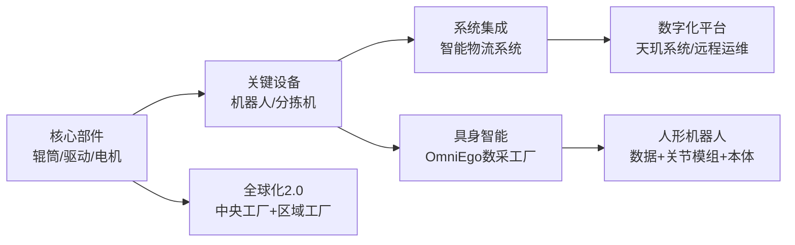

先给你一个结论版概览，再展开细讲。
---
## 一、一句话结论
- 德马科技的基本面是：**智能物流装备全产业链龙头**，从核心部件（辊筒、直驱电机）到关键设备（机器人、分拣机）再到系统集成，整体营收规模中等偏上、盈利能力尚可，但负债率偏高、应收账款偏大，现金流在改善中。  
- 核心竞争力：**“全产业链+数字化+全球化”**，叠加在**物流辊筒和具身智能数据采集**上的稀缺卡位。  
- 稀缺性：  
  1）输送分拣专用辊筒是**国家级制造业单项冠军**，国内市占率约 25%、全球约 10%，全球最大辊筒制造基地之一；  
  2）A股里极少数同时具备**“核心零部件+物流场景+具身智能数据采集工厂+机器人本体/关节模组布局”**的标的，被市场定位为物理 AI 时代的“数据卖铲人”。  
- 最近大涨：**“智能物流/机器人主题+具身智能/物理 AI 炒作+业绩与现金流改善+全球化与并购落地+资金与情绪共振”**，多因素叠加，而不是单一逻辑。
---
## 二、基本面：业务结构与财务概况
### 1. 业务结构：从一颗辊筒到全产业链
公司定位：**智能物流系统、关键设备及其核心部件的研发、设计、制造、销售和服务**，是国内智能物流装备领域的领先企业。
收入结构（以 2024 年年报为主，近年趋势大致相同）：
- 智能物流输送分拣核心部件（辊筒、智能驱动单元、直驱电机等）：  
  - 收入约 9.89 亿元，占营收约 68%；  
  - 毛利率约 31.8%，是公司的**利润基石**。
- 智能物流输送分拣系统及其关键设备：  
  - 收入约 3.0–3.5 亿元，占比约 30% 左右；  
  - 毛利率约 16–20%，系统集成竞争更激烈，毛利率明显低于核心部件。
- 其他及售后：占比小。
2025 年年报显示，**核心部件业务收入 12.25 亿元，同比增长 23.91%，占营收比重提升到 73%，毛利率 32.11%**，进一步向高毛利的核心部件集中。
### 2. 财务表现：营收增长稳健，盈利质量有隐忧
关键数据（单位：亿元）：
| 指标 | 2023A | 2024A | 2025A | 2026Q1 |
|------|-------|-------|-------|--------|
| 营业收入 | 13.84 | 14.57 | 16.85 | 3.97 |
| 营收增速 | - | 5.3% | 15.6% | 13.2% |
| 归母净利润 | 0.87 | 0.93 | 0.95 | 0.37 |
| 净利润增速 | - | 5.6% | 2.9% | 17.1% |
| 毛利率 | 约 26–27% | 28.2% | 29.0% | 32.7% |
| 资产负债率 | 47.4% | 51.1% | 56.4% | 约 58%+ |
| 经营性现金流/净利润 | - | 1.78 / 0.93 ≈ 1.9x | 2.09 / 0.95 ≈ 2.2x | 0.48 / 0.37 ≈ 1.3x |
几点结论：
- **营收增速双位数，利润增速偏低**：2025 年营收 +15.6%，但归母净利仅 +2.9%，扣非净利则是 -4.4%，主要靠政府补助和减值转回支撑。  
- **毛利率持续改善**：从 2023 到 2026Q1，毛利率从 26–27% 提升到 32.7%，核心部件占比提升是主因。  
- **现金流明显好转**：2024、2025 年经营现金流/净利润都接近或超过 2 倍，2026Q1 经营现金流由去年同期净流出转为净流入 4756 万元，现金流健康度提升。  
- **负债率持续走高**：三年资产负债率从 47.4% 升到 56.4%，高于行业平均约 39.5%，偿债压力偏大。  
- **应收账款偏大**：有分析指出应收账款/利润已达 562.85%，需关注回款风险。
整体看：**主业稳健、盈利质量一般、现金流改善但杠杆偏高**，基本面是“有亮点但不完美”。
---
## 三、核心竞争力：全产业链 + 数字化 + 全球化
用一个结构图先把核心逻辑拆开：

### 1. 全产业链：从“一颗辊筒”到整线解决方案
- 公司从输送辊筒起家，逐步延伸到智能驱动单元、直驱电机、智能输送/分拣设备、机器人，再到整厂智能物流系统解决方案，是**少数覆盖自动化物流输送分拣装备全产业链的企业**。
- 核心部件自给率高，**关键设备与系统用的辊筒、驱动大部分自产**，既保障性能又控制成本，还能对外销售给其他系统集成商，形成“部件+设备+系统”一体化优势。
- 这带来：
  - **成本与交付优势**：模块化设计、标准化生产，全球快速复制项目；
  - **技术协同**：做部件的理解整机，做整机的反哺部件迭代，形成正向循环。
### 2. 数字化能力：天玑系统 + 全流程闭环
- 公司开发了基于物联网、数字孪生、AI 的**“天玑系统”**，对全球项目设备进行远程监控、故障诊断、运维，减少非计划停机，延长资产寿命。
- 同时打通 CRM/PLM/ERP/MES 等系统，实现从招投标、设计、生产、运维到报废的全流程数字化闭环。
- 深层影响：
  - 从“卖设备一次性收入”走向“设备+远程运维+持续服务”的**长尾收入**；
  - 数据沉淀为后续 AI / 具身智能训练打下基础。
### 3. 全球化 2.0：从“产品出口”到“本地服务本地”
- 公司较早布局海外，在澳大利亚、罗马尼亚设有全资工厂，美国、马来西亚有合作组装基地，日本、巴西、新加坡等地设立子公司和营销中心。
- 提出**全球化 2.0 战略**，核心是“本地服务本地”，形成“中央工厂+全球区域工厂+本地合作组装工厂”的网络。
- 2025 年海外收入约 3.96 亿元，占比 23.5%，毛利率 29.62%，高于整体，且拿下了 Shein 等北美大仓项目。
- 意义：**海外项目毛利更高、账期更友好**，对冲国内价格战和内卷。
### 4. 技术与资质：国家级企业技术中心 + 单项冠军
- 公司技术中心被认定为**国家企业技术中心**，拥有博士后科研工作站、院士工作站等平台。
- 截至 2024 年底，累计拥有 61 项核心技术、684 项专利和软件著作权。
- 辊筒产品：  
  - 2022 年“输送分拣专用辊筒”被工信部认定为**国家级制造业单项冠军产品**；  
  - 国内市占率约 25%，全球约 10%，是全球最大辊筒制造基地之一。
---
## 四、稀缺性：辊筒单项冠军 + 具身智能数据卡位
### 1. 辊筒：全球范围的“单项冠军”
- 辊筒是物流输送分拣设备的核心部件，约占设备价值量 15–20%。
- 德马：
  - 年产辊筒约 2000 万支，全球最大辊筒制造基地之一；
  - 国内市占率约 25%、全球约 10%，全球前 20 强物流系统集成商中约 80% 使用其辊筒；
  - 产品被工信部评为“制造业单项冠军”，代表细分领域全球最高水平。
- 这意味着：**在物流辊筒这一细分赛道上，德马具有全球话语权和定价权**，是真正意义上的“隐形冠军”。
### 2. 具身智能 / 物理 AI：稀缺的“数据卖铲人”
- 公司自研 **OmniEgo 具身智能数据采集全管线**，2025 年 7 月投产全球首家具身 AI 物流数采工厂：  
  - 月产 20 万小时以上第一视角高质量数据；  
  - 自标注覆盖率 85%+，标注效率提升约 90%，成本降低约 80%。
- 与智元机器人、优必选等头部人形机器人企业深度合作，共建数据采集中心、推动物流场景规模化应用。
- 同时布局**自研直线关节模组、战略投资精密传动关节模组、联合发布具身机器人本体**，2026 年 1–4 月关节模组等产量已达 2.6 万台（套），超过 2025 全年。
- 市场将其定位为：**物理 AI 时代的“数据卖铲人”**——在大家都盯着“做机器人本体”的时候，它卡位的是**更上游、更刚需的数据和关键零部件**。
- 稀缺性体现：
  - A 股同时具备**“物流场景+数采工厂+核心零部件+机器人本体/关节布局”**的标的极少；
  - 数据是具身智能的“卡脖子环节”，谁掌握高质量场景数据，谁就有模型和迭代优势。
---
## 五、最近大涨的原因：主题+基本面+资金+情绪共振
综合多篇异动分析和龙虎榜信息，大致可以拆成几条主线：
### 1. 主题与风格：智能物流 + 机器人 + 具身智能/物理 AI
- 市场风格 2026 年以来明显向**“物理 AI / 人形机器人 / 具身智能”**切换，物流仓储被视为物理 AI 最具确定性的落地场景之一。
- 德马科技主营智能物流系统、物流移动机器人、具身智能机器人及智能输送分拣系统，**天然站在“AI+机器人+物流”的风口上**。
- 同一时间，智能物流板块整体上涨，形成板块联动效应。
### 2. 具身智能布局密集落地，被市场当成“物理 AI 标杆”
- 2025 年与智元机器人共建人形智能机器人物流数据采集中心；  
- 2026 年与优必选签署战略合作，推动工业智造及智能物流场景规模化应用；  
- 自研 OmniEgo 数采工厂投产、自研关节模组、联合发布机器人本体等，**一系列动作在 2025–2026 年密集兑现**。
- 在“具身数据元年”的叙事下，公司被部分资金视为**物理 AI 时代的“数据卖铲人”**，享受估值溢价。
### 3. 业绩与现金流改善：从“讲故事”到“有数据”
- 2025 年营收 +15.6%，2026Q1 营收 +13.2%、归母净利 +17.1%，增速较 2024 年明显加速。
- 2026Q1 毛利率提升到 32.74%，盈利能力改善；经营现金流由去年同期净流出转为净流入 4756 万元，现金流健康度明显提升。
- 并购标的莫安迪 2023–2025 年实际净利润远超业绩承诺，三年累计净利润超承诺一倍，验证并购逻辑。
- 这些数据让市场觉得：**不是纯概念，而是有业绩兑现的“成长+主题”双击**。
### 4. 全球化与并购落地：长期逻辑逐步验证
- 全球化 2.0 战略下，美国子公司设立、澳洲产能扩建、欧洲/拉美项目落地，海外订单持续爆满，产量增幅超 50%。
- 莫安迪并购完成，补齐直驱电机与驱动技术，协同效应逐步体现。
- 对市场而言，这降低了“只讲海外故事、不落地”的担忧。
### 5. 资金与情绪：龙虎榜 + 大宗交易 + 机构研报
- 2026 年 5 月 19 日，德马科技因涨幅达到 15% 登上龙虎榜，被视为市场热度的重要信号。
- 5 月 21 日出现一笔折价约 21% 的大宗交易，被部分解读为**机构低位吸筹**。
- 中邮证券在 5 月 18 日发布研报，给予“增持”评级，强调业绩稳健增长和具身智能布局，进一步强化市场信心。
- 技术面上，MACD 指标金叉、短期资金流入，也吸引趋势资金跟进。
### 6. 股东会与资本运作预期
- 2026 年 5 月 19 日股东会通过未来三年股东回报规划、授权董事会发行股票等决议，被市场解读为**管理层对未来有信心、有资本运作空间**。
- 在成长股里，这类“能分红+能再融资”的公司，往往更受资金青睐。
---
## 六、综合评估：优点与风险
### 优点
1. **赛道好**：智能物流装备行业 CAGR 约 20%+，社会物流费用/GDP 仍有下降空间，自动化与智能化是长期趋势。  
2. **卡位强**：辊筒全球单项冠军+具身智能数据稀缺卡位，技术壁垒和话语权较高。  
3. **全产业链**：从核心部件到系统，一体化能力在国内同行中少见，成本和协同优势明显。  
4. **全球化+数字化**：海外业务毛利更高，天玑系统打开服务与数据变现空间。  
5. **业绩与现金流改善**：2025–2026Q1 营收增速回升、毛利率上行、经营现金流大幅好转。
### 主要风险
1. **负债率持续抬升**：近三年资产负债率从 47.4% 升至 56.4%，高于行业平均，偿债压力偏大。  
2. **主业盈利波动**：2025 年扣非净利下滑，Q4 单季亏损，盈利季节性波动明显。  
3. **应收账款偏大**：应收账款/利润超过 560%，存在回款与资产质量风险。  
4. **主题炒作成分重**：当前股价包含较多“具身智能/物理 AI”预期，一旦机器人落地进度不及预期，估值回调风险较大。  
5. **合规与内控**：曾因违规使用募资收到证监局警示函，募投项目延期，内控曾存在瑕疵。
---
### 小结
- 从基本面看，德马科技是**智能物流装备里“有技术、有场景、有全球布局”的细分龙头**，辊筒单项冠军和具身智能数据工厂是其最稀缺的标签。  
- 最近大涨，是**“智能物流/机器人主题 + 具身智能/物理 AI 叙事 + 业绩与现金流改善 + 全球化与并购落地 + 资金与情绪共振”**的结果，而不是单一逻辑。  
- 中长期空间取决于：机器人/具身智能在物流场景的落地速度、海外扩张与杠杆控制、以及数据与关节模组等新业务能否真正兑现为利润。  
- 短期则要警惕：主题退潮后的估值回落、负债与应收账款风险、以及业绩季节性波动。
以上基于公开财报与券商研报整理，不构成任何投资建议，仅供你研究参考。
