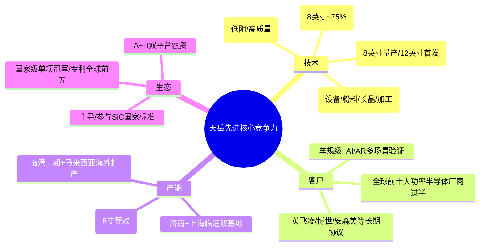

先把结论放前面：
- 天岳先进目前是**全球碳化硅（SiC）衬底龙头**：2025年导电型衬底市占率约27.6%，8英寸市占率51.3%，整体市占率全球第一，已超越Wolfspeed，技术+产能+客户都在第一梯队。  
- 核心竞争力与护城河集中在：**大尺寸领先（8英寸量产、12英寸首发）、全流程自研+液相法工艺、全球头部客户绑定、产能规模与自动化**，这些形成高门槛，短期很难被复制。  
- 稀缺性：在**全球SiC衬底尤其是8英寸大尺寸、车规级、半绝缘/P型等高端产品**上，天岳是极少数能量产、且通过国际大厂认证的供应商之一，属于“核心材料+关键卡位”的稀缺标的。  
- 未来上涨空间：  
  - 中短期（1–2年）核心看**8英寸放量+毛利率修复+扭亏为盈**，机构普遍预期2026年营收20亿左右、净利润2–3亿元，对应当前股价（约167元）动态PE约90–130倍，仍处于高估值消化期，**向上的弹性主要取决于盈利兑现和8英寸放量节奏**。  
  - 中长期（3–5年）看**SiC行业从6英寸向8英寸/12英寸升级+新能源/AI/AR等新应用渗透**，若天岳维持龙头份额，理论市值仍有数倍空间，但路径上会有价格战、产能周期、技术迭代等波动，属于高赔率、高波动品种。
下面按你关心的几个维度拆开说。
---
## 一、公司基本面概况
- 公司：山东天岳先进科技股份有限公司  
- 股票：688234.SH（科创板） / 02631.HK（A+H两地上市）  
- 主业：碳化硅（SiC）单晶衬底研发、生产和销售，是第三代半导体核心材料，下游主要用在**新能源汽车、光伏储能、5G射频、AI电源/AR眼镜等**场景。  
关键财务数据（单位：亿元）：
| 年度 | 营收 | 同比 | 归母净利 | 毛利率 | 备注 |
|------|------|------|----------|--------|------|
| 2022 | 4.17 | - | -1.75 | 低 | 早期扩产、亏损 |
| 2023 | 12.51 | +200% | -0.46 | 低位 | 产能爬坡 |
| 2024 | 17.68 | +41% | 1.79 | 25.9% | 扭亏为盈，高增 |
| 2025 | 14.65 | -17% | -2.08 | 13.05% | 行业价格战+一次性费用拖累 |
2026Q1：营收3.66亿，同比-10.4%；净利-0.61亿；毛利率19.12%，环比+25个百分点，出现明显修复迹象。
---
## 二、核心竞争力：为什么天岳是龙头？
用一个结构图先概括一下：

### 1. 技术壁垒：大尺寸+全流程+液相法
- **大尺寸领先**  
  - 8英寸导电型衬底已大规模量产，2025年8英寸全球市占率约51.3%，远超其他厂商（多数<15%）。  
  - 2024年全球首发12英寸SiC衬底，并完成N型、P型、半绝缘全系列矩阵，是**全球唯一能量产12英寸全品类SiC衬底**的企业之一。  
  - 12英寸单片晶圆可用面积较8英寸提升约2.25倍，芯片产出量提升近2倍，是下一代降本的关键方向。
- **全流程自研，不被“卡脖子”**  
  - 从粉料合成、长晶炉设计、晶体生长、切片、研磨、抛光到表征，关键环节都自主可控；长晶炉与设备厂商联合定制，核心参数掌握在自己手里。  
  - 专利方面，碳化硅衬底专利数量全球前五、国内第一，并在欧、日、韩等关键市场布局专利，为进入英飞凌、博世等国际大厂供应链保驾护航。
- **液相法P型衬底**  
  - 首创液相法制备8英寸P型衬底，生长速度快、缺陷少、电阻率更低，适配特高压/智能电网等高端场景，是区别于传统PVT法的重要技术路线。
- **良率与成本优势**  
  - 8英寸衬底良率约75%左右，高于行业平均65–70%；12英寸良率约65%，高于行业40–50%。  
  - 大尺寸+高良率+自动化，使得单位成本持续下降，在价格战环境下仍有盈利修复空间。
### 2. 客户与认证壁垒：全球头部供应链深度绑定
- 已与**全球前十大功率半导体器件制造商中超过一半**建立合作，包括英飞凌、博世、安森美等，并多次获得博世“优选供应商”、富士康金奖等。  
- 与英飞凌签订长期供货协议，预计占其长期需求量的两位数份额，是公司导电型衬底放量的关键保障。  
- 客户结构：  
  - 境外收入占比约47.5%，2024年海外收入同比+104%，首次超过境内，说明产品已进入国际主流供应链。  
  - 车规级客户覆盖比亚迪、小米、保时捷等800V高压车型；AI/AR方向与Meta等光学头部客户合作，用于AR眼镜光波导等场景。
这种**长期协议+车规级认证+国际大厂背书**，是典型的护城河：新进入者验证周期往往要1–2年，一旦进入就很少轻易更换衬底供应商。
### 3. 产能与规模：双基地+海外扩产
- 2025年公司碳化硅衬底产量折合约69.04万片（6英寸等效），同比+68.3%；销售63.33万片，同比+75.3%，产能利用率接近满产。  
- 产能布局：  
  - 济南基地：成熟产线，6/8英寸混合。  
  - 上海临港一期：年产30万片导电型衬底，已满产；二期推进中，目标整体8英寸产能达60万片/年。  
  - 马来西亚槟城：规划24万片/年切磨抛产能，并规划8英寸产能50万片/年，服务海外客户、规避地缘风险。  
- 产能结构：  
  - 2025年销量中，8英寸营收占比约62%，6英寸约38%；8英寸已是核心增长极。  
规模效应+自动化，使得公司在价格战中仍能通过成本下降保持盈利修复空间，这是与中小衬底厂拉开差距的关键。
### 4. 生态与政策：A+H+国家级认可
- 2025年8月在港交所上市，成为**唯一“A+H”上市的碳化硅衬底企业**，融资能力增强，为扩产和研发提供资金保障。  
- 两度获评**国家制造业单项冠军**（半绝缘型+导电型SiC衬底），是业内罕见的“双冠王”。  
- 主导/参与制定《碳化硅单晶抛光片堆垛层错测试方法》等国家标准，开始从技术领先走向“规则制定者”。
---
## 三、护城河：哪些是真正难复制的？
结合上面的竞争力，可以把天岳的护城河概括为四条：
1. **技术代差护城河**  
   - 8英寸量产+12英寸首发+液相法P型，整体领先追赶者1–2代。  
   - 专利池+国家标准，使得后来者即使想抄，也需要规避大量专利，时间和资金成本极高。
2. **客户与认证护城河**  
   - 车规级SiC衬底认证周期长、要求苛刻，一旦通过就形成强黏性；  
   - 英飞凌、博世等大厂倾向“双供应商”，但首选往往是天岳这类已深度验证的龙头，新进入者很难撼动份额。
3. **规模与成本护城河**  
   - 70万片/年级别产能、高良率+自动化，让单位成本持续下探；  
   - 在6英寸价格战最激烈的阶段，公司主动降价抢份额，2026Q1毛利率已修复至19%左右，说明成本优势足以支撑价格战。
4. **生态与资本护城河**  
   - A+H双平台融资、国家大基金和产业资本加持，使得公司可以持续高研发+扩产；  
   - 政策端对第三代半导体、国产替代的倾斜，进一步抬高龙头的话语权。
---
## 四、稀缺性：到底“稀”在哪儿？
从行业格局看：
- 全球SiC衬底市场高度集中，2023年前五大厂商合计市占率约68.3%，头部效应明显。  
- 2025年，天岳先进导电型SiC衬底全球市占率约27.6%，6英寸约27.5%，8英寸约51.3，三项均为全球第一，是**唯一在8英寸上份额过半的厂商**。  
- 国内能做8英寸SiC衬底的厂商很少，公开信息显示：  
  - 三安光电：湖南8英寸衬底产能约1000片/月，重庆8英寸衬底产能约2000片/月，整体规模远小于天岳。  
  - 天科合达：国内第二大衬底厂商，8英寸已量产，但更多侧重导电型，产能规模与天岳仍有差距。  
- 在**半绝缘型衬底（5G/射频）、P型衬底（特高压/电网）、12英寸光学/AR衬底**等细分方向，天岳是国内少数能量产、且通过国际头部客户验证的厂商，属于结构性稀缺。
所以，天岳的稀缺性可以概括为：
- **“全球8英寸SiC衬底绝对龙头”**：份额过半、技术+产能+客户三重领先；  
- **“国内大尺寸+车规级+特种衬底平台”**：在6/8/12英寸、导电/半绝缘/P型、车规/AI/AR多维度都有成熟产品，这种全品类+全尺寸能力在国内几乎是唯一的。
---
## 五、未来上涨空间：怎么看？
### 1. 行业空间：SiC衬底是“万亿赛道”的核心材料
- 全球碳化硅衬底市场2019–2023年从26亿元增长到74亿元，CAGR约29.4%；预计到2030年可达664亿元，CAGR约39%。  
- 另一组数据：2025年全球SiC衬底市场约11.8亿美元，预计2032年增至30.16亿美元，CAGR约14.6%。  
- SiC功率器件市场，Yole预计2027年可达62.97亿美元，2022–2027年CAGR>34%。  
核心驱动力：
- 新能源车：800V高压平台渗透率提升，SiC主驱逆变器从“高端选配”走向“主流标配”；  
- 光伏储能：SiC逆变器效率可达99%以上，替代硅基IGBT趋势明确；  
- AI数据中心：800V HVDC、固态变压器、AI电源架构升级，SiC在电源+散热/中介层的应用潜力巨大；  
- AR眼镜：SiC高折射率、高导热，用作光波导基底，是轻量化+全彩化的关键材料。
简单讲：**SiC衬底是新能源+AI+AR的“底层材料”，行业长期空间是千亿级甚至更高。**
### 2. 公司成长路径：8英寸放量+12英寸商用+新场景渗透
- 8英寸：  
  - 相比6英寸，8英寸衬底单片芯片产出增加约90%，成本可降低约50%，是行业升级的核心方向。  
  - 公司8英寸市占率已超50%，随着临港二期、马来西亚工厂投产，8英寸收入占比有望从当前约60%进一步提升，带动整体毛利率回升。
- 12英寸：  
  - 单片芯片产出是6英寸约4倍，是长期降本的关键；  
  - 目前已向头部客户批量供应，主要用于AR眼镜光波导、AI先进封装中介层等高端场景，预计2026–2027年逐步放量。
- 新场景：  
  - AI电源/先进封装：台积电CoWoS等先进封装对SiC中介层需求快速起量，公司产品适配性高，被多家研究机构视为核心受益标的。  
  - AR/VR光学：SiC光波导衬底已与舜宇奥来等光学龙头合作，未来有望随AI眼镜放量。
### 3. 盈利与估值：短期看修复，中长期看成长
- 2025年因行业价格战、主动降价抢份额、补缴税款及港股上市费用等，公司由盈转亏，毛利率仅13.05%。  
- 2026Q1毛利率回升至19.12%，环比+25个百分点，亏损收窄，拐点初步确认。  
- 机构对2026年盈利预期大致在：  
  - 营收：19–24亿元  
  - 归母净利：0.68–2.24亿元，多数在1–2亿区间  
当前股价约167元，总市值约809亿元（2026-05-27盘中数据）。
- 若2026年净利润取2亿元，对应当前PE约400倍；  
- 若按部分机构给的2026年净利润5亿左右的高增速情景，PE约160倍；  
- 多数机构给出的目标价区间在96–121元之间，较当前股价有下行空间，但也有高盛等给出115元目标价，对应约30%左右上行空间。
这说明：  
- **当前估值已经透支了一部分中长期成长预期**，股价更多在交易“8英寸放量+AI/AR逻辑”的远期空间；  
- 中短期上涨空间更取决于**盈利兑现（尤其是毛利率能否稳定在20%以上）和8英寸/12英寸订单节奏**，而不是单纯的估值扩张。
### 4. 风险点：决定上涨空间能不能真正兑现
- 行业价格战：6英寸低端产能仍过剩，8英寸也可能逐步进入红海竞争，价格持续下行会压制毛利率。  
- 产能扩张不及预期：设备调试、良率爬坡、海外工厂建设都有不确定性，若扩产节奏放缓，可能错失份额扩张窗口。  
- 下游需求不及预期：新能源车、AI数据中心、AR眼镜等如果渗透放缓，会直接压制衬底需求。  
- 12英寸/新应用商业化节奏：若12英寸量产或AR/先进封装应用落地慢于预期，长期逻辑会被拉长，估值回调压力加大。  
- 地缘政治与贸易摩擦：海外收入占比高，关税、出口管制等可能影响订单和扩产节奏。
---
## 六、综合判断：值不值得关注？
- **基本面**：天岳先进已经是全球SiC衬底龙头，技术+产能+客户都在第一梯队，2026Q1毛利率修复明显，盈利拐点初现。  
- **护城河与稀缺性**：在8英寸大尺寸、车规级、半绝缘/P型等高端产品上具备显著稀缺性，护城河较宽，短期难以被替代。  
- **上涨空间**：  
  - 若只看1–2年，当前估值不便宜，上涨空间更多来自**盈利修复+8英寸放量**带来的业绩弹性，股价大概率会随财报和订单数据高波动；  
  - 若看3–5年，在SiC行业持续高景气+公司维持龙头份额的前提下，市值仍有数倍空间，但路径上会有价格战、产能周期等考验。
**如果你是偏长期、能接受高波动的投资者**，天岳先进属于“赛道+卡位+龙头”三者兼具的核心标的，值得重点跟踪，关键观察点是：  
1）毛利率能否稳定在20%以上并逐步向25–30%修复；  
2）8英寸出货量和收入占比持续提升；  
3）12英寸和AR/AI新应用订单落地节奏。
**如果你更看重稳健和估值安全边际**，当前高PE+行业价格战背景下，更适合分批跟踪、等估值更合理的击球区，而不是重仓追高。
以上只是基于公开信息的分析，不构成任何买卖建议。SiC行业变化快，建议你持续跟踪公司季报、8英寸/12英寸订单、行业价格和竞争格局变化，再动态调整自己的判断。
