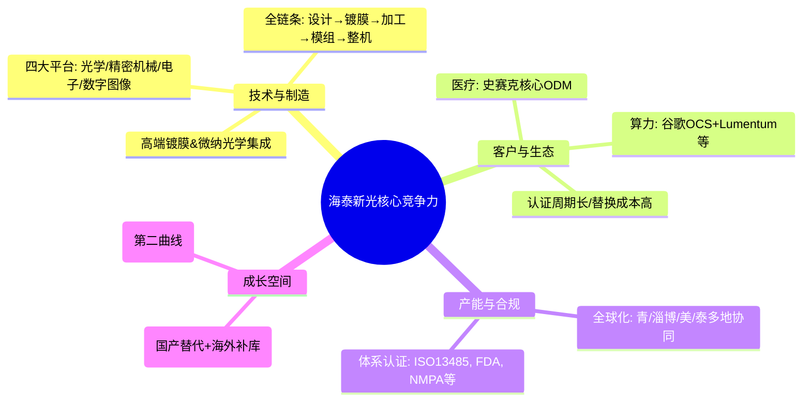

先给结论：
- 近期涨幅：不是单一年度“暴涨”，而是2025年业绩拐点确立、叠加AI光互联（OCS）故事+海外产能布局，在科创板弹性下的集中兑现。2026年3月16日至4月27日，30个交易日内收盘价偏离值累计+200%，属于“严重异常波动”，公司自查无未披露重大事项。
- 核心竞争力：全球少有的“光学全链条（设计→镀膜→精密加工→模组/整机集成）”企业，医疗+光学双轮驱动，已深度切入AI算力光互联供应链。
- 技术壁垒：四大技术平台（光学/精密机械/电子/数字图像）、高端镀膜与微纳光学集成、在医疗和AI OCS场景的“高设计+高工艺”产品体系，认证周期长、替换成本高。
- 护城河：客户壁垒（史赛克、谷歌、Lumentum等）、全球化制造与质量体系（FDA/NMPA等）、技术外溢形成的跨场景复制能力（医疗→AI算力/工业等）。
---
## 一、最近涨幅到底有多大？关键驱动是什么？
### 1. 涨幅与市场特征
- 交易特征：2026-03-16 至 2026-04-27，收盘价偏离值累计+200%，交易所认定为“严重异常波动”。
- 估值水平：2026-04-27 收盘价118.76元，对应滚动PE约75倍，高于专用设备制造行业平均约68倍。
- 价格区间：2026-04-27 当日涨停报118.76元，盘中最高到125.21元，近一年新高。
- 机构动作：2026年一季度以来频繁登龙虎榜，4月27日单日主力净流入约0.77亿元；2026-04-25 接待80家左右机构调研。
### 2. 业绩端：从“去库存承压”到“高增拐点”确立
- 2024年：受海外大客户去库存影响，营收同比下降5.9%至4.43亿元、归母净利润下降7.1%至1.35亿元。
- 2025年：业绩显著修复——
  - 营收6.03亿元，同比+36.08%；
  - 归母净利润1.71亿元，同比+26.15%；
  - 扣非净利润1.66亿元，同比+28.40%。
- 分季度看：2025Q3 单季收入1.82亿元、同比+85.3%，归母净利润0.62亿元、同比+130.7%，显著强化“拐点”预期。
- 2026Q1：营收1.74亿元、同比+18.8%；归母净利润0.47亿元、同比+1.1%；剔除汇率与股份支付后，公司称净利润同比增幅约23.4%，经营端仍然高景气。
→ 市场把“2024去库存结束+2025/26业绩进入上行周期”作为第一层基础逻辑。
### 3. 业务与赛道端：医疗稳健 + AI光互联打开第二曲线
- 医疗内窥镜（基本盘）：
  - 2025年内窥镜业务收入约4.76亿元，同比+37.9%，占主营约79.3%，毛利率约71.3%。
  - 深度绑定国际龙头史赛克，作为核心ODM供应商，海外收入占比约75–76%。
  - 新产品：4K荧光、3D/4K/荧光三合一系统、多种镜体（宫腔镜、膀胱镜、小儿腹腔镜等）持续注册/放量。
- 光学+AI算力（新曲线）：
  - 2025年光学业务收入1.24亿元，同比+29.98%。
  - 公司披露已切入谷歌OCS（光交叉连接）光互联供应链，并深度绑定Lumentum等，聚焦“算力光器件/光模块”，订单能见度较长。
  - 部分机构调研认为：到2028年，“光业务（AI算力+通信）”收入有望超越医疗成为第一大来源。
→ AI算力光互联故事，是2025下半年至2026年股价“重估”的关键主题之一。
### 4. 供应链与地缘：海外产能提前布局，降低关税风险
- 公司在泰国与美国布局生产基地，对美销售绝大部分已转移至泰国生产，有效对冲关税风险。
- 泰国二期、美国二期产线启动，涵盖光学加工、镀膜、维修、整机装配等，进一步强化全球供应能力。
- 多份研报把“海外产能落地”视为业绩高增与估值提升的加分项。
### 5. 交易层面：科创板弹性+机构集中调研+融资推动
- 科创板20%涨跌幅+高波动属性，叠加业绩与故事共振，容易形成集中拉升。
- 融资余额自2026年3月以来持续攀升，从约2.3亿元升至4.4亿元区间，显示资金持续加杠杆参与。
- 机构密集调研、多篇“买入”研报、市场对AI光互联的想象，放大情绪溢价。
---
## 二、核心竞争力：真正护城河在哪里？
下面这张结构图概括了海泰新光的竞争框架（后文会逐项展开）：

### 1. “光学全链条”能力（设计→镀膜→加工→集成）
- 官网明确：公司围绕“光学、精密机械、电子、数字图像”四大技术平台，具备从系统设计、光机设计到光学加工、镀膜、封装、部件装配和系统集成的完备产业链。
- 覆盖医疗内窥镜、生物识别、精密光学等多场景，核心工艺自主可控。
→ 能把“标准件做得极精密”，也能做“复杂系统级光学解决方案”，这是和普通光学代工厂拉开差距的关键。
### 2. 医疗内窥镜：史赛克供应链中的“卡位”
- 产品：高清荧光/白光腹腔镜、4K荧光LED光源模组、摄像适配器/镜头等。
- 历史节点：2008年推出全球首款LED内窥镜光源；2015年推出荧光腹腔镜等创新产品。
- 客户：与史赛克长期合作，作为其核心ODM供应商之一，2025年内窥镜业务占比接近80%，毛利率约71.3%。
- 国产替代：国内硬镜市场进口占比高，公司多款产品已在国内注册并销售，整机业务逐步放量。
→ 医疗端的核心优势是“国际龙头验证+高毛利+国产替代空间”，是现金牛和估值锚。
### 3. 光学+AI算力：从医疗向“算力基础设施”的延展
- 公司定位为“全栈式光学解决方案商”，强调不做标准件，聚焦高设计壁垒、高工艺难度的模组与系统。
- 在AI算力侧，披露已：
  - 直接向谷歌OCS供货光学组件；
  - 与Lumentum深度绑定，成为其OCS业务首家合作厂商之一。
- 技术路径：通过“高功率激光阈值控制+全波段镀膜+微纳光学集成”解决硅光散热、损耗与延迟痛点。
- 多份研报明确：光学业务将成为第二增长曲线，公司正围绕AI算力场景布局算力光器件和光模块。
→ 这是市场最看重的“第二曲线”：用医疗光学积累的技术，去解决AI数据中心光互联刚需，有订单能见度与国产替代逻辑。
### 4. 全球化制造与质量合规体系
- 生产与研发布局：青岛、淄博、美国硅谷、美国里诺、泰国，形成“研发+制造+服务”全球协同。
- 认证：ISO13485/9001/14001/45001，产品获FDA、NMPA等认证，多次通过跨国客户体系与现场审核。
- 供应链安全：泰国基地承担绝大部分对美产能，美国基地负责本土交付，有效应对贸易政策不确定性。
→ 对医疗器械与高端通信客户而言，这种全球合规与稳定供应本身就是重要护城河。
---
## 三、技术壁垒：为什么不是谁都能复制？
### 1. 四大平台：多学科复合的系统性门槛
- 光学技术：系统设计、镀膜、微纳加工等；
- 精密机械：光机结构、封装与可靠性；
- 电子控制：驱动、信号与FPGA应用开发；
- 数字图像：图像处理与算法。
公司披露具备从设计到整机的一体化能力，研发人员覆盖全链条。这种复合能力很难通过简单扩产复制。
### 2. 高端镀膜与微纳光学集成
- 公司拥有数十台镀膜设备，配置IAD离子辅助沉积、磁控溅射、离子束溅射等多种工艺，针对不同材料与性能指标做工艺优化。
- 产品层面：
  - 医疗：荧光滤光片、高透过率/低畸变/高耐压灭菌的光学镜片等；
  - AI OCS：超精密微型光学组件，满足低损耗、低延迟与高功率要求。
→ 镀膜与微纳光学是典型“工艺know-how密集型”，参数调优与良率爬坡需要多年积累。
### 3. 认证与客户验证周期带来的“时间壁垒”
- 医疗：内窥镜进入欧美市场需要通过FDA/NMPA等认证，并长期经受临床与监管审核。
- AI OCS：客户认证周期通常2–3年，一旦进入供应链，替换成本高。
→ 即便竞争对手拿到图纸，要跨越“设计→工艺→客户验证→长期稳定供应”这一链条，时间成本很高。
---
## 四、护城河的可持续性与关键风险
### 可持续性
- 技术→客户正循环：医疗光学积累的技术（精密镀膜、微型镜片、低损耗光路）可直接复用到AI OCS，实现跨场景技术变现。
- 客户黏性：史赛克、谷歌、Lumentum等头部客户对供应商的技术稳定性与交付能力要求极高，一旦进入体系，合作通常长期延续。
- 产能布局：青/淄博/美/泰的全球分工，使公司在关税与地缘政治变化下更具韧性。
### 需要正视的风险
- 客户集中度较高：内窥镜业务高度依赖史赛克等少数大客户；一旦订单或合作生变，业绩波动会很大。
- AI光互联落地节奏：目前算力光器件/光模块仍处于研发/小批量试制阶段，未来放量存在技术与市场不确定性。
- 估值与波动：当前滚动PE远高于行业平均，业绩若阶段性不及预期，估值回调风险不小。
- 汇率与财务费用：海外收入占比高，汇率波动与财务费用（利息、汇兑）对净利率有明显扰动。
---
## 五、小结：如何理解这轮上涨与公司质地
- 上涨本质：  
  业绩端（2025高增+2026延续）+ 赛道端（医疗基本盘+AI光互联第二曲线）+ 交易端（科创板弹性+融资与机构推动）共振，把公司从“医疗光学隐形冠军”重估为“医疗+算力光互联双轮驱动”的高成长标的。
- 护城河的“硬”点：  
  1）全栈光学与微纳制造能力；  
  2）史赛克/谷歌/Lumentum等顶级客户的长期验证与认证壁垒；  
  3）全球化制造与质量体系，保证交付稳定性与合规性。
- 投资视角的关键：  
  - 短期看：海外补库强度、泰国/美国二期投产节奏、AI光互联订单放量进度；  
  - 中长期看：医疗端国产替代与整机放量、光业务对营收结构的改变、能否如期兑现“2028年光业务超越医疗”的产业预期。
以上基于公开信息梳理，不构成任何投资建议。
