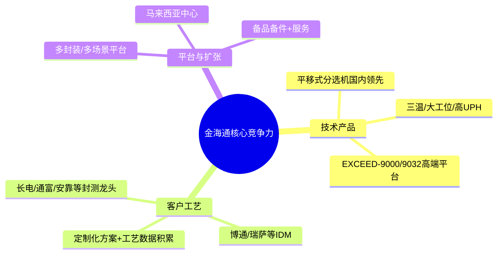

金海通的核心竞争力，不是“泛泛的半导体设备”，而是**在平移式测试分选机这个极窄的细分里，做到国内第一、技术指标对标国际一线，且与头部封测/IDM客户深度耦合**。它的稀缺性主要来自：**细分赛道足够窄+技术壁垒足够高+国产替代刚起步+客户工艺数据与整线匹配形成的隐性壁垒**。如果只看一句话：**金海通是“平移式IC测试分选机”这一细分里的国产龙头，稀缺性在于——这个赛道本身门槛极高、玩家极少，而它又在国内明显领先，且正踩在AI/车规/先进封装带来的测试升级风口上。**
---
## 一、公司定位与业务结构：先搞清楚它在卖什么
- 全称：天津金海通半导体设备股份有限公司，股票代码603061，上交所主板。
- 主营：**集成电路测试分选机（Test Handler）**的研发、生产、销售，属于半导体后道封测设备。
- 产品线：EXCEED-6000/8000/9000系列、SUMMIT、COLLIE、NEOCEED等，覆盖常温、高温、三温测试，支持QFN、QFP、BGA、LGA、CSP、TSOP等多种封装形式。
- 收入结构（2024年）：
  - 测试分选机：收入3.53亿，占主营86.69%，毛利率46.33%；
  - 备品备件：0.51亿，占12.43%，毛利率52.98%；
  - 其他：不足1%。
- 行业归属：申万“电子-半导体-半导体设备”，核心概念：半导体设备、封测概念、专精特新等。
**关键点：它不是“宽口径”的半导体设备公司，而是高度集中在“测试分选机”这一个环节，而且以平移式分选机为主。**
---
## 二、行业位置：赛道窄、门槛高、玩家少
### 1. 测试分选机在产业链里的位置
- 半导体测试设备主要分三类：测试机（ATE）、探针台、分选机。
- 分选机作用：**把待测芯片自动送到测试工位，根据测试结果分档、标记、收料**，是封测环节的核心设备之一。
- 分选机按传输方式分为：
  - 平移式：技术难度最高，适用于大尺寸芯片，占比约47%；
  - 转塔式：速度快，适用于高密度测试，占比约43%；
  - 重力式：传统封装，占比约9%。
金海通专注的是**平移式分选机**，也就是技术难度和占比最高的那一块。
### 2. 市场空间与增速
- 全球测试分选机市场：
  - 2022年全球IC测试分选机市场规模约17.85亿美元，预计2029年达39.79亿美元，CAGR约11.5%。
  - 另一组数据：2025年全球半导体测试分选机市场约26.16亿美元，预计2032年达53.87亿美元，CAGR约11%。
- 行业驱动力：
  - AI/HPC芯片复杂度提升，测试时间拉长；
  - 先进封装/Chiplet推动KGD、系统级测试需求；
  - 车规、功率器件要求三温测试，设备单价提升。
**结论：赛道绝对规模不算特别大，但增速不低（10%+），且技术迭代带来的“量价齐升”逻辑清晰。**
### 3. 竞争格局：海外寡头垄断 + 国产少数玩家
- 全球格局：
  - 测试机：泰瑞达、爱德万合计份额超90%；
  - 分选机：Cohu（Xcerra）、Advantest、长川科技、台湾鸿劲、金海通等前五大厂商约占全球59%份额。
- 国内格局：
  - 国产分选机整体市占率已超35%，中低端基本完成进口替代，高端仍在追赶；
  - 平移式分选机：恒州诚思数据，金海通在国内市占率约47.36%，居国内第一；
  - 主要国内对手：长川科技（平台化，测试机+分选机）、深科达（转塔式为主），规模和聚焦度都不如金海通在平移式分选机上的专精。
**行业层面稀缺性：**
- 分选机本身是“窄赛道”，全球就那几个玩家；
- 平移式分选机又是里面技术最复杂、门槛最高的一块；
- 金海通在这一小块里做到**国内第一、全球前五**，这就是它的行业卡位。
---
## 三、金海通的核心竞争力：抓主要矛盾
从“主要矛盾”的角度，金海通的核心竞争力可以压缩成三点：
1. **技术+产品：在平移式分选机上做到国内领先、指标对标国际**
2. **客户+工艺：与头部封测/IDM深度耦合，形成高转换成本**
3. **平台化能力：从单机到多场景平台，从国内到海外**
用一个结构图看更清楚：

### 1. 技术与产品：在细分赛道做到“国内最好、世界能打”
- 核心技术体系：
  - 高速运动姿态自适应控制
  - 高兼容性上下料
  - 高精度温控（三温：-55℃～+155℃）
  - 芯片全周期流程监控
- 关键指标：
  - UPH（每小时产出）最高可达13,500颗；
  - Jam Rate（故障停机率）<1/10,000；
  - 温度范围覆盖-55℃～+155℃，满足车规级三温测试；
- 产品迭代：
  - EXCEED-8000→9000系列，是整体平台性升级，在温控、并测工位、可测芯片尺寸等方面持续迭代；
  - EXCEED-9032等大平台、32工位并行三温测试设备，是面向AI、车规、先进封装的高端机型。
**对比国内对手：**
- 长川科技：测试机+分选机平台化，分选机毛利率约40%，低于金海通52%+，说明金海通在分选机这一细分上的产品溢价更强。
- 深科达等：规模较小，且以转塔式为主，与金海通不在同一细分赛道。
**抓主要矛盾：**
- 在“平移式分选机”这个细分里，金海通**技术指标国内最接近海外巨头**，这是它最硬的核心竞争力。
### 2. 客户与工艺：不是卖设备，而是“卖整线能力+工艺数据库”
- 客户结构：
  - 封测厂：长电科技、通富微电、华天科技等；
  - IDM：博通、瑞萨等；
  - 设计公司：澜起科技、艾为电子等。
- 合作深度：
  - 承担国家02专项“SiP吸放式全自动测试分选机”课题，设备进入长电、通富等产线验证；
  - 针对MEMS、SiC/IGBT、先进封装等开发专用分选平台，与头部客户联合验证；
  - 软件定制化程度高、集成度高，响应速度快，满足国内客户频繁切换测试方案的需求。
**这里的核心是：**
- 测试分选机不是“标准品”，而是要跟测试机、探针台、产线节拍整线匹配；
- 客户一旦用顺了一套分选机方案，**切换成本极高**——工艺参数、程序、维护经验都要重来；
- 金海通与头部客户长期迭代，积累了**“客户工艺数据库+整线调试经验”**，这是比设备本身更难复制的隐性壁垒。
### 3. 平台化与扩张：从单机到多场景、从国内到海外
- 产品平台化：
  - 从消费电子→AI算力→车规/功率，覆盖不同封装、不同温区；
  - EXCEED-9000系列2025年收入占比已过半，带动毛利率从47%提升至52%+。
- 区域扩张：
  - 境外收入2025年约0.86亿元，同比+125.6%，2026Q1境外收入占比从18%提升到约25%；
  - 马来西亚生产运营中心2025年上半年启用，贴近海外客户，提升服务响应速度。
- 备品备件+服务：
  - 备品备件收入占比约9–12%，毛利率高于整机，提供持续现金流；
  - 高故障响应速度（宣传4小时响应，优于行业平均），增强客户粘性。
**抓主要矛盾：**
- 金海通不是只卖一台“机器”，而是**卖一整套“分选解决方案+长期服务”**，这让它的护城河比硬件本身更深。
---
## 四、稀缺性：为什么说金海通“不好替代”？
从“稀缺性”角度，可以把金海通的优势拆成三层：
### 1. 细分赛道的稀缺：平移式分选机本身玩家就少
- 全球能做高端平移式分选机的企业，一只手数得过来：Cohu、Advantest、长川、金海通等；
- 国内真正把平移式分选机做量产、做进头部封测厂产线的，**金海通是少数之一**；
- 这不是“想做就能做”的生意——涉及精密机械、高速运动控制、视觉、软件、温控等多学科交叉，试错成本极高。
### 2. 技术与产品线的稀缺：国内唯一能覆盖三温/大工位/多场景的平台
- 三温测试（-55℃～+155℃）+ 大平台超多工位并行测试，是AI、车规、先进封装的刚需；
- 国内能同时提供：
  - 常温/高温/三温；
  - 小尺寸/大尺寸芯片；
  - 消费/AI/车规/功率等多场景平台的，**金海通几乎独一无二**；
- 这使得它在国内**高端分选机**这一块，有明显的“卡位优势”。
### 3. 客户与工艺数据的稀缺：不是你想换就能换
- 测试分选机要与测试机、产线节拍深度匹配，客户切换供应商成本极高；
- 金海通与长电、通富、安靠等长期合作，**掌握了大量测试方案、工艺参数和故障模型**；
- 新进入者即使做出样机，也**缺乏这些“看不见的工艺数据”**，很难在短期内获得客户信任。
**一句话概括稀缺性：**
> 在一个“窄但高门槛”的细分赛道里，金海通同时具备：**国内领先的技术+完整的平台化产品+头部客户工艺数据库+整线匹配经验**，这种组合在A股里非常稀缺。
---
## 五、财务与成长：用数据验证“核心竞争力”是否真赚钱
### 1. 近几年业绩：从承压到爆发
- 2022–2024：收入小幅增长，但利润承压（研发、费用加大）；
- 2025：营收6.98亿，同比+71.68%；归母净利润1.77亿，同比+124.93%；
- 2026Q1：营收2.84亿，同比+120.77%；归母净利润0.83亿，同比+221.54%；毛利率52.96%，净利率29.06%。
**关键点：**
- 收入、利润增速远超行业平均，说明**不是吃行业β，而是有自己的α**；
- 毛利率从47%左右提升到52%+，核心是**高端产品（EXCEED-9000系列）占比提升**，验证了“技术驱动产品结构升级”的逻辑。
### 2. 盈利质量与风险
- 2024年：营收+17.12%，但净利润-7.44%，主要因股份支付、期间费用上升；
- 2024年应收账款同比+40.27%，增速高于营收，需关注信用风险；
- 2025年起经营现金流大幅改善，2026Q1经营现金流净额1.02亿元，同比+1602%。
**抓主要矛盾：**
- 短期波动（费用、应收）确实存在，但**高端产品放量+毛利率提升+现金流改善**的趋势更关键，这是核心竞争力在财务上的体现。
---
## 六、如何看金海通的“主要矛盾”和“稀缺性”——一个简单框架
如果你只想记住一个框架，可以这样看：
1. **主要矛盾：**
   - 行业层面：AI/车规/先进封装 → 测试复杂度↑ → 分选机从“简单搬运”变成“高精度、高并行、多温区”的关键设备；
   - 公司层面：金海通靠**平移式分选机技术+头部客户工艺数据**，在国内拿到了最稀缺的“入场券”，并通过高端产品放量兑现到业绩上。
2. **稀缺性：**
   - 细分赛道稀缺：平移式分选机全球玩家少，国内能做高端的更少；
   - 技术平台稀缺：三温+大工位+多封装平台，国内几乎唯一；
   - 客户工艺稀缺：与封测/IDM长期合作形成的工艺数据库和整线匹配能力，难以快速复制。
3. **需要跟踪的核心点：**
   - 高端产品（EXCEED-9000/9032等）收入占比和毛利率趋势；
   - 海外收入占比和马来西亚中心的订单转化；
   - 应收账款和信用减值，是否随规模扩张而失控；
   - 行业周期下行时，订单和价格的韧性。
---
**最后强调：**  
以上是基于公开资料和券商研报的基本面分析，不构成任何投资建议。金海通的稀缺性和核心竞争力是真实存在的，但当前估值也不低（TTM市盈率曾达60倍以上），是否值得买，还要结合你自己的风险偏好和估值体系来判断。
