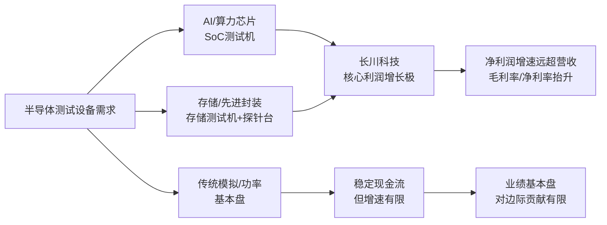

长川科技的主要矛盾 = “高端测试机（SoC/存储）放量 + 国产替代”对利润的拉动，远大于传统模拟/功率测试机和分选机的影响。它的核心竞争力 = 在国产厂商中率先完成“测试机+分选机+探针台+AOI”全品类平台化，并在SoC/存储测试机这一最高价值量赛道上实现技术突破和批量供货。它的稀缺性 = 在A股，是唯一能同时做到这两点的半导体测试设备公司：全品类平台 + 高端SoC/存储测试机国产替代，叠加深度绑定头部封测/存储原厂。
下面按你的要求，抓主要矛盾展开。
---
## 一、先看基本面轮廓：高增速 + 高盈利 + 高研发
关键数据（2025年报 + 2026Q1）：
- 2025年：
  - 营收 52.92 亿元，同比 +45.31%
  - 归母净利润 13.31 亿元，同比 +190.42%
  - 扣非净利润 12.50 亿元，同比 +201.86%
  - 综合毛利率 55.05%，净利率 25.39%
  - 研发投入 12.68 亿元，占营收 23.97%
- 2026Q1：
  - 营收 13.78 亿元，同比 +69.09%
  - 归母净利润 3.53 亿元，同比 +217.6%
  - 扣非净利润 3.25 亿元，同比 +612.27%
  - 毛利率 56.81%，净利率 26.05%
特征：
1. 利润增速远超收入：高端产品放量 + 规模效应，这是“主要矛盾”在财务上的直接体现。
2. 毛利率、净利率双高：测试机毛利率 62%+，远超一般设备公司，说明产品结构偏高端。
3. 研发费用率长期 20%+：高研发是后续高端突破的基础，也是护城河的一部分。
---
## 二、用一张图看清主要矛盾：长川的增长引擎

这张图想说的是：  
真正驱动长川业绩和估值跃升的，是 B/C 两条线——AI/SoC + 存储/先进封装，而传统模拟/功率只是“基本盘”。  
下面围绕这个主要矛盾拆核心竞争力与稀缺性。
---
## 三、核心竞争力：抓“高端测试机 + 平台化 + 客户绑定”三条主线
### 1. 产品线：从单点设备到“全品类平台”，这是和国内对手的最大差异
长川是国内少数/唯一实现“测试机 + 分选机 + 探针台 + AOI”四大核心品类全覆盖的厂商：
- 测试机：  
  - 模拟/数模混合、功率、SoC/数字测试机、存储测试机全覆盖
  - SoC 测试机 D9000 系列是国内率先量产的高端数字测试机，2018 年推出，比国内同行早 5 年左右
- 分选机：  
  - 重力式、平移式、转塔式全品类，三温分选机适配车规等高可靠性场景
- 探针台：  
  - 12 英寸全自动探针台，已量产，面向晶圆 CP 测试
- AOI：  
  - 通过收购新加坡 STI 切入 2D/3D 高精度光学检测，进入前道/先进封装检测
含义：
1. **一站式解决方案能力**：客户一旦用上长川的整线方案，切换成本极高，粘性强。
2. **协同效应**：测试机放量会带动分选机、探针台、AOI 的配套机会，反过来丰富数据与工艺理解，形成正反馈。
**这构成了长川最核心的护城河之一：平台化带来的客户粘性与生态壁垒。**
---
### 2. 技术与赛道：真正拉开差距的是“高端 SoC / 存储测试机”
从财务和业务结构看，测试机才是“主要矛盾”：
- 2025 年：
  - 测试机收入 32.03 亿元，同比 +55.29%，占营收 60.53%
  - 分选机收入 15.68 亿元，同比 +31.76%，占营收 29.64%
  - 其他（探针台 + AOI 等）合计约 10%
- 测试机毛利率约 62%，分选机约 41%，测试机是利润绝对主力
关键点：**不是所有测试机都一样值钱，真正拉开差距的是 SoC/存储测试机。**
- SoC 测试机：
  - D9000 系列支持 200Mbps 速率、28nm 制程，对标泰瑞达/爱德万主流平台
  - 已进入华为昇腾等国产 AI 算力链，批量供货
  - 相比国内同行早 5 年左右推出，先发优势明显
- 存储测试机：
  - 国内存储测试机市占率约 35%，是长江存储、长鑫存储等的核心供应商
  - 支持 DDR5、HBM3E 等先进方案，是国内少数能提供高端存储测试方案的厂商
行业背景（也很关键）：
- 全球 SoC/存储测试机市场长期被泰瑞达、爱德万等垄断，国产化率不足 15%
- AI 芯片复杂度提升，测试环节在芯片成本中的占比从约 2% 升至 10%+，测试设备“量价齐升”
因此，**长川的核心竞争力，不是“做测试机”，而是“在最高价值量的 SoC/存储测试机上实现了国产替代并批量供货”。**
---
### 3. 客户与渠道：深度绑定国内封测龙头 + 国际大厂
- 国内：
  - 长电科技、华天科技、通富微电等头部封测厂是核心客户
  - 前 5 大客户销售额从 2021 年 6.13 亿元增至 2025 年 30.51 亿元，占比从 40.61% 升至 57.66%
- 海外：
  - 通过收购 STI、EXIS，进入 TI、三星、日月光、安靠、美光等供应链
客户结构的含义：
1. **认证周期长**（6–12 个月），一旦导入很难被替换，形成高客户壁垒。
2. **头部封测 + 存储原厂**的资本开支对设备需求有放大效应，长川的订单弹性更大。
3. 海外客户验证了技术实力，也为后续海外扩张打开空间。
**所以，长川的护城河不是单点技术，而是“高端测试机 + 全品类平台 + 头部客户绑定”的组合。**
---
## 四、稀缺性：在 A 股，它是“唯一一个”同时满足这三条的公司
从“稀缺性”角度，你要问的是：**为什么是长川，而不是别人？**
### 1. 全品类平台：国内唯一真正实现“测试机+分选机+探针台+AOI”全覆盖
多家研报/公司资料都强调：长川是国内唯一/极少数实现四大品类全覆盖的半导体测试设备平台型企业。
这意味着：
- 对客户：可以一站式采购整线，减少集成和协调成本，粘性高。
- 对长川：单台测试机切入后，有机会顺着产线延伸分选机/探针台/AOI，实现**单客户价值量放大**。
- 对竞争对手：要同时覆盖四大品类，需要极长的时间和巨大研发投入，后来者很难在短时间内复制。
**这是长川在 A 股半导体设备中非常稀缺的“平台属性”。**
---
### 2. 高端 SoC / 存储测试机的国产替代：不是“有产品”，而是“已经放量”
国内做测试机的公司不少，但真正在 SoC/存储高端赛道上形成批量供货的极少：
- SoC 测试机：
  - 长川 D9000 系列是国内最早量产的高端 SoC 测试机之一，2018 年推出，比国内主要同行早 5 年左右。
  - 已进入华为昇腾等 AI 算力链，是国产 AI 芯片测试设备的核心供应商之一。
- 存储测试机：
  - 长川存储测试机国内市占率约 35%，是长江存储、长鑫存储的核心供应商。
  - 支持 DDR5、HBM3E，是国内少数能量产高端存储测试方案的企业。
对比行业：
- 全球 SoC/存储测试机国产化率仍不足 15%，高端机台几乎完全依赖进口。
- 在这个背景下，**长川是国内极少数真正实现从 0 到 1、从样机到量产、进入主流大厂供应链的厂商**。
**这是长川在“技术稀缺性”上最硬的一块：不是简单做测试机，而是在最难、价值量最高的 SoC/存储测试机上实现了国产替代。**
---
### 3. 客户结构与国产替代位置：大基金加持 + 头部封测/存储原厂绑定
- 股东层面：
  - 国家集成电路产业投资基金（大基金）为重要股东，提供战略与资源背书。
- 客户层面：
  - 国内：长电/华天/通富等封测龙头 + 长江存储/长鑫存储等存储原厂。
  - 海外：通过 STI/EXIS 进入 TI、三星、日月光、美光等供应链。
含义：
1. **在国产替代“深水区”，长川是少数能替代爱德万、泰瑞达份额的本土厂商**。
2. 大基金 + 头部客户组合，使得公司在政策、订单、验证节奏上都处于更有利的位置。
**这是“身份与位置”的稀缺：在国产测试设备赛道里，长川是龙头中的龙头，是国产替代的首选标的。**
---
## 五、把主要矛盾再说透：什么真正驱动长川的估值与业绩
结合上面几点，可以这么概括长川的主要矛盾：
1. **赛道层面**：  
   - 测试设备是全球半导体产业链中“卡脖子”的关键一环，长期被泰瑞达、爱德万等垄断。
   - SoC/存储测试机又是测试设备中价值量最大、技术壁垒最高的细分，国产化率极低。
2. **公司层面**：  
   - 长川是国内极少数在 SoC/存储测试机上实现技术突破 + 批量供货的公司。
   - 同时，它又是 A 股唯一实现“测试机+分选机+探针台+AOI”全品类平台化的企业。
3. **财务层面**：  
   - 测试机收入占比 60%+，毛利率 62%+，是利润绝对主力。
   - 高端测试机放量带动整体毛利率、净利率上行，利润增速远超收入增速。
因此，**长川的核心矛盾不是“做不做测试机”，而是“能不能在 SoC/存储高端测试机上持续替代海外巨头，并借全品类平台放大单客户价值量”。**
---
## 六、最后小结：一句话概括长川的核心竞争力与稀缺性
- **核心竞争力**：  
  在国产半导体测试设备中，长川是少数同时在“技术深度（SoC/存储高端测试机）+ 产品广度（四大品类平台化）+ 客户绑定（头部封测/存储原厂）”上形成合力的公司，这种组合带来高客户粘性、高利润率和持续的技术迭代。
- **稀缺性**：  
  在 A 股，长川是**唯一一个**同时满足以下三点的半导体测试设备公司：  
  1）全品类平台（测试机+分选机+探针台+AOI）；  
  2）在 SoC/存储高端测试机上实现国产替代并批量供货；  
  3）深度绑定国内封测龙头 + 存储原厂 + 大基金等国家级资本。  
如果你接下来要做更细的估值或风险判断，关键就是围绕这三条看：  
- 高端测试机订单与单价是否持续兑现；  
- 平台化能否真正带来单客户 ARPU 提升；  
- 国产替代节奏是否会被地缘政治或行业周期打断。
