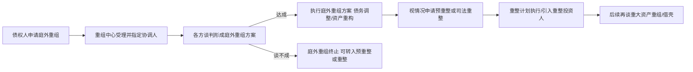

先把结论放前面：
1. 重组进展：美芝股份目前处在“庭外重组刚起步、尚未被受理”的早期阶段，既没有形成具体方案，也没有进入司法重整，更没有任何现成的资产注入或借壳安排。一切只是“起跑信号”，不是终点。  
2. 预期：短期（1–2年）核心是“先保壳、再重整”，真正意义上的借壳/重大资产重组大概率要拖到重整完成、合规问题清理之后，时间上不会快。  
3. 作为壳资源：按当前A股对“好壳”的主流标准，美芝是一个“中等偏上但明显有硬伤”的壳——市值小、国资背景、主业基本出清是优点；但负债率极高、净资产为负、已被*ST且受公开谴责，这些会明显压低借壳方意愿和谈判地位。更适合作为“重整+产业整合”平台，而不是那种随便什么资产都能往里装的干净小壳。
---
## 一、重组进展：目前只在庭外重组第一步
### 1. 最新关键节点
根据公司公告及媒体梳理，时间线大致如下：
- 2026年5月15日：债权人佛山市南海区金盾电子工程有限公司向深圳市福田区企业重组服务中心申请对*ST美芝进行重组。  
- 2026年5月27日：公司董事会审议通过《关于庭外重组并推荐重组协调人的议案》，同意进行庭外重组，并推荐北京市金杜（深圳）律师事务所 + 深圳诚信会计师事务所联合体担任重组协调人。  
- 同日，公司发布风险提示公告：  
  - 庭外重组为“自愿协商程序”，无法律强制约束力；  
  - 能否被重组中心受理、能否与债权人达成方案，都存在不确定性；  
  - 本次庭外重组“不代表公司必然进入司法预重整或重整程序”。
### 2. 庭外重组在整个路径中的位置
目前深圳、上海等地推的“庭外重组—预重整—正式重整”路径，美芝现在只走到最前面：

关键点：
- 现在只完成“债权人申请 + 公司同意并推荐协调人”，**重组中心尚未正式受理**，更没有形成任何具体方案。  
- 公司公告反复强调：  
  - “庭外重组以各方自愿协商为基础，无法律强制约束力”；  
  - 若主要债权人反对或达不成协议，重组中心可不予受理或终止程序。  
- 公司同时明确：**目前不存在在途的重大资产重组、股份发行、收购、资产注入等事项**，近期网络流传的“实控人资产注入”“控制权变更”等均属不实传闻。
### 3. 伴随的“自救动作”：债务与资产清理
在庭外重组推进前后，公司还在做一系列“减包袱”动作，为后续重整/重组腾空间：
- 2025年12月–2026年1月：  
  - 债权重组：以对圣悯（上海）医疗的债权抵偿对佛山市政大沥分公司的应付款，金额约525万元，构成债务重组。  
  - 债权重组：以中铁建工集团抵债房产（6套房）抵偿其对公司约1193万元债权，产生债权重组损失约188万元。  
  - 公开挂牌转让对朱涛的业绩承诺债权权益，评估值约7632万元，以盘活资产、回收资金。  
- 2025年6月：公司向大股东关联方南海城建投的关联借款4.94亿元，获免息展期，属于国资“输血”保流动性。  
这些操作本质是：**先尽量把账面资产变现、把债务结构理一理，为后续更大的重整/重组铺路**。
---
## 二、重组预期：短期保壳，中长期才谈得上“借壳”
### 1. 短期（1–2年）：重整保壳为主，借壳为辅
1）退市压力非常明确
- 2025年年报：营收3.53亿元，同比-49.9%；归母净利-2.14亿元；期末归母净资产-5246.62万元；资产负债率约100.65%。  
- 因净资产为负且持续经营能力存疑，公司股票自2026年4月30日起被实施“退市风险警示+其他风险警示”，简称变更为*ST美芝。  
- 若2026年继续触及净资产为负、营收不达标等情形，将被终止上市。
2）监管与合规“扣分项”
- 深交所公开谴责：公司及董事长、总经理、财务总监因2025年业绩预告“漏报净资产为负、退市风险提示严重滞后”，被公开谴责，记入诚信档案。  
- 历史资金占用：2019年原实控人李苏华通过投标保证金占用公司资金，公司和原实控人均被深圳证监局采取责令改正监管措施。  
- 劳动用工、消防等行政处罚：2024–2025年因农民工工资专用账户、实名制管理、消防设施等问题被多部门罚款，金额不大但暴露内控问题。  
- 原实控人业绩对赌诉讼：佛山南海国资背景的控股股东广东怡建，就原实控人李苏华违反业绩对赌和最低持股承诺提起诉讼，索要业绩补偿款3.48亿元及违约金，目前该案发回重审，结果不确定。
3）政策导向：重整先于重组
- 2024年底《上市公司破产重整案件工作座谈会纪要》明确：重整应聚焦债务化解和基本经营恢复，投资人认购股份应以货币对价为主，**以注入资产作为对价被严格限制**。  
- 实务中，近几年“破产重整+重大资产重组同步完成”的案例极少，多数是先重整保壳、再过几年再谈资产注入或借壳。
综合来看：
- **未来1–2年主线**：通过庭外重组 → 预重整 → 正式重整，先把净资产做正、债务压下来、保住上市资格。  
- **真正意义上的借壳/重大资产重组**，大概率要拖到重整完成、合规问题清理、高管处罚影响消除之后，时间上不会早于2027–2028年。
### 2. 中长期：取决于国资战略和产业政策
- 控股股东为广东怡建股权投资合伙企业（有限合伙），实控人为佛山市南海区国资局，持股约29.99%，表决权控制约22.8%。  
- 公司在年报中明确：将“紧扣新质生产力发展方向，持续跟踪、挖掘、论证战略性新兴产业与未来产业领域的优质并购标的与整合机会”。  
- 广东省层面正在推动“上市后备企业对拟退市企业的并购”，有把这类平台作为产业整合载体的政策导向。
所以中长期预期可以概括为：
- **乐观情景**：重整顺利 → 国资主导引入产业投资人 → 2–3年后实施定向增发或资产注入，实现“借壳上市”或类借壳。  
- **悲观情景**：重整失败或保壳失败 → 终止上市转入三板，壳价值基本归零。  
---
## 三、作为壳资源的评价：美芝算不算一个“好壳”？
### 1. A股“壳资源”的主流评价标准
综合券商研报和实务经验，评价一个壳好不好，通常看几大类指标：
| 维度           | 常见“好壳”标准 | 对应借壳方的考虑 |
|----------------|----------------|------------------|
| 市值           | ≤ 30–40亿（越小越好） | 控制权成本低，股本扩张空间大 |
| 股权结构       | 大股东持股30–50%，股权相对集中但非一股独大；质押/冻结少 | 谈判对象少，交易简单，过户风险小 |
| 资产负债       | 资产负债率 ≤ 50%，无大额隐性负债、担保、诉讼 | 借壳方不愿替别人还债 |
| 合规与处罚     | 近3年无重大违法违规、无立案调查、未被*ST或公开谴责 | 否则监管审核难、风险大 |
| 行业与主业     | 传统夕阳行业、主业基本停顿，资产较“轻” | 容易置换出新主业 |
| 注册地与国资   | 发达地区、非偏远；若为国资，需有“可谈空间” | 国资卖壳审批复杂、防流失顾虑多 |
| 退市风险       | 无即时退市风险，或已有明确保壳路径 | 壳价值在于“活下去” |
### 2. 把美芝放进这个框架里打分
下面用一张简化的“雷达图”打分（1–5分，5=最符合好壳标准）：
| 指标             | 美芝现状 | 符合好壳程度 | 说明 |
|------------------|----------|--------------|------|
| 市值             | 约25–30亿总市值 | 4 | 市值偏小，壳成本不高，是加分项 |
| 股权结构         | 控股股东广东怡建持股29.99%，实控人为佛山南海国资；二股东李苏华持股11.24%且股份被司法冻结 | 3 | 集中度尚可，但二股东诉讼和冻结增加不确定性；国资背景有利有弊 |
| 资产负债率       | 2025年末资产负债率约100.65%，净资产-5246万元 | 1 | 极高负债、资不抵债，是最差的档，借壳方基本要靠重整先“洗壳” |
| 合规与处罚       | 深交所公开谴责；历史资金占用已整改；多起劳动用工/消防行政处罚 | 2 | 不是立案调查那种“雷”，但公开谴责+行政处罚拖后腿，再融资/重组受限 |
| 行业与主业       | 建筑装饰行业，营收连年下滑，主业基本只剩“壳” | 4 | 典型夕阳行业、资产轻，容易被置换，是加分项 |
| 注册地与国资背景 | 广东深圳+佛山南海国资实控 | 3 | 地域好，但国资卖壳审批链条长、防流失顾虑大，比民企壳复杂 |
| 退市风险         | 已被*ST，2026年若继续净资产为负或营收不达标将退市 | 2 | 有即时退市压力，必须先保壳，对借壳方来说是“先交一笔重整学费” |
综合看：
- **优点**：市值小、行业传统、资产轻、注册地在发达地区、国资背景有资源。  
- **硬伤**：资不抵债、负债率极高、已被*ST且受公开谴责，存在历史资金占用和多项行政处罚。  
按这个组合，**美芝更像是“需要先花大力气修的房子”，而不是那种拎包入住的干净小壳**。
### 3. 和市场典型“好壳”对比
早年研报总结的理想壳画像：市值<40亿、负债率<50%、ROE差、股权分散、实控人为自然人、非创业板、无重大违法违规。  
对比之下：
- 美芝在“市值、行业、股权集中度”上接近好壳；  
- 在“资产负债率、合规记录、退市风险”上明显更差；  
- 国资背景既增加信用背书，也增加审批复杂度，属于“中性偏复杂”。
---
## 四、综合判断：美芝是“什么样的壳”？适合什么人？
1. **从壳质量看：中等偏上，但硬伤明显**
- 如果只看“市值+行业+股权结构”，是一个还不错的壳；  
- 一旦加上“资产负债率+合规记录+退市风险”，对普通借壳方吸引力明显下降——**必须搭配一个强有力的重整投资人，先把债务和合规问题解决**。
2. **从路径看：更像是“重整+产业整合平台”，而不是随便装资产的壳**
- 当前政策鼓励通过重整化解风险，再以定增等方式注入新质生产力资产；  
- 对佛山南海国资来说，这个平台更可能用来导入本地产业升级项目（高端制造、新能源、数字经济等），而不是单纯卖给一个借壳方套现走人。
3. **对投资者的含义**
- 如果你博弈的是“短期借壳拉升”，美芝的节奏大概率会让你失望：  
  - 真正的借壳/资产注入要等重整完成，时间以年计；  
  - 期间股价更多受保壳进度、重整进展、情绪炒作影响，波动极大，公司自己都在反复提示“非理性炒作风险”。  
- 如果你把它当成“困境重整+国资产业整合”的长期标的，则要重点关注：  
  - 庭外重组能否被受理、能否形成可行方案；  
  - 重整投资人的实力和产业背景；  
  - 2026年能否保住上市资格（净资产转正、营收达标）。
---
**一句话总结：**
- 作为壳资源，美芝股份**有壳形（小市值、夕阳行业、国资背景），但壳里堆满了债务和合规问题**，需要先“大修”才能住人。  
- 现在谈“是不是一个好壳”，更多是在问：**有没有人愿意出钱出力，把这套房子先修好，再重新装修？**  
- 从目前公开信息看，这条路有方向，但路长、不确定性大，更适合风险承受能力很强、能跟踪重整进展的投资者，而不是冲着“壳价值短线炒作”的人。
