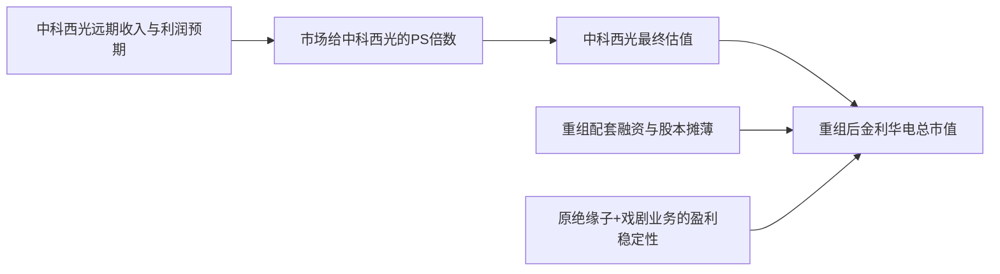

目前公告只出了重组预案，审计、评估都没完成，**中科西光的真实估值还是个“谜”**，所有数字都只能是区间假设，不是定论。媒体和研报对中科西光的估值大致在：  
- 一级市场“常规商业航天估值”口径：**5–10 亿元**  
- 部分二级市场/股吧情绪口径：**80–120 亿元**  
- 你自己看到的雪球/股吧“目标市值 200 亿”之类，更多是情绪目标，缺乏硬财务数据支撑。  
以金利华电现在 **市值约 35.8 亿元、净资产约 2.73 亿元、总股本 1.17 亿股** 的体量，去吃下一个估值在 5–120 亿元区间的标的，**乐观和悲观的核心差异，就在于中科西光最终按什么估值进重组、以及重组后市场给多少 PS/PE 倍数**。  
下面我按你要求的思路，分三步走：  
1. 先把重组公告的关键信息拆一下；  
2. 再把中科西光的估值区间梳理出来；  
3. 最后在乐观/悲观两种假设下，推演重组后金利华电的估值和股价区间（强调：是情景推演，不是投资建议）。
---
## 一、重组公告核心信息拆解
### 1. 交易结构
根据金利华电 5 月 19 日披露的重组预案及董事会公告：
- 交易方式：  
  - **发行股份 + 支付现金**，购买西安中科西光航天科技集团有限公司（中科西光）**82.5% 股权**；  
  - 同时向控股股东 **山西红太阳旅游开发有限公司** 发行股份募集配套资金。  
- 交易性质：  
  - 构成关联交易（向控股股东募资）；  
  - 预计构成**重大资产重组**；  
  - **不构成重组上市**，控制权不变。  
- 标的：中科西光 82.5%股权，交易完成后中科西光成为控股子公司。  
关键点：  
> “截至目前，本次交易的审计、评估工作尚未完成，标的资产的评估值及交易价格尚未确定。”
也就是说：**现在连标的估值都还没定，更别提具体发股价格、发股数量、现金对价比例了**，所有测算都只能建立在假设上。
---
### 2. 标的资产中科西光的情况
综合公告和媒体报道：
- 成立时间：2021 年 1 月，注册资本约 1714.38 万元；  
- 股东背景：  
  - 由中科院西安光机所全资资产管理公司 **西安西光产业发展有限公司** 代表持股；  
  - 核心管理团队 + 多家投资机构（达科讯飞、智泽星辰、龙华天启等 11 名交易对方）。  
- 业务定位：  
  - 高光谱遥感卫星：**从核心载荷到整星研制、从星座组网到数据应用**的全链条；  
  - 主打“西光系列”高光谱遥感星座，规划到 2030 年完成 **158 颗卫星组网**（108 通用 + 40 双碳监测 + 10 功能型）；  
  - 已发射 11 颗卫星，包括国内首颗点源甲烷监测商业卫星“西光壹号 04 星”和唯一在轨 400–2500nm 全谱段商业高光谱卫星“西光壹号 06 星”。  
- 行业地位：  
  - 国家级专精特新“小巨人”企业；  
  - 陕西省航天产业链链主企业（全省仅 6 家）。  
- 数据资产化：  
  - 2025 年完成全国首单高光谱卫星数据资产入表，评估价值 **超过 2700 万元**，获八大数据交易所认证。  
**盈利情况：**  
- 公告和公开报道目前**没有披露中科西光营收、利润的具体数据**，只强调其处于组网早期、重投入阶段，尚未规模化盈利。  
- 行业整体特点：商业航天公司普遍**高投入、长周期、短期难盈利**。
---
### 3. 金利华电自身的基本面
根据 2025 年年报和 2026 年一季报：
- 收入与利润：  
  - 2025 年：营收约 2.20 亿元，同比 -19.24%；归母净利润约 -534 万元，转亏；  
  - 2026Q1：营收 5088 万元，同比 +54.76%；归母净利润 304 万元，扭亏。  
- 业务结构：  
  - 玻璃绝缘子业务：约占营收 87–89%，毛利率约 33–34%；  
  - 文化/戏剧演出业务：规模较小，2025 年收入下滑约 36%。  
- 资产与股本：  
  - 总资产约 7.70 亿元，净资产约 2.73 亿元；  
  - 总股本 1.17 亿股，总市值约 35.8 亿元（停牌前 30.6 元/股）。  
- 估值：  
  - 市净率约 13 倍，市销率约 15 倍，PE TTM 为负（亏损）。  
一句话：**主业承压、市值不大、净资产很薄，是一个典型“小市值+壳属性+转型诉求”的公司**。
---
## 二、重组标的估值：中科西光到底值多少钱？
### 1. 一级市场融资与估值线索
综合多家媒体梳理：
- 融资节奏：  
  - 2022 年：天使轮，陕西科创航天种子基金；  
  - 2023 年 1 月：A 轮近 1 亿元，投资方包括西高投、成都科创投、西安财金等；  
  - 2024 年 12 月：B 轮，安徽海源资本；  
  - 2025 年：B+ 轮，中商汇投参与。  
- 注册资本：1714 万元。  
- 媒体对估值的主流判断：  
  - 晨哨/网易等：**“注册资本 1714 万元，A 轮融资 1 亿元，若按常规商业航天估值，其投后估值可能在 5–10 亿元区间。”**  
  - 部分文章/股吧情绪：认为中科西光是“高光谱遥感绝对龙头、稀缺全链条资产”，合理估值中枢 **80–120 亿元**。  
这两个口径差异非常大，本质上是：
- **5–10 亿元**：偏“一级市场、按最近融资轮次推算”的理性估值；  
- **80–120 亿元**：偏“二级市场叙事+情绪溢价”，把高光谱遥感+数据资产+中科院背景的“故事价”拉满。
### 2. 行业可比公司能给出的 PS/PE 参考上限
以 A 股最典型的“卫星制造+应用”公司 **中国卫星（600118）** 为例：
- 2025 年：营收 61 亿元，归母净利润仅约 0.36 亿元，净利率不到 1%；  
- 2026Q1：营收 6.09 亿元，同比 +38%，但净利亏损 0.43 亿元；  
- 截至 2026 年 4 月底：  
  - 市值约 1100+ 亿元，市销率约 17–28 倍，市盈率数千倍。  
也就是说，**即便像中国卫星这样收入体量巨大、但盈利极薄的央企卫星平台，市场给到 PS 也就 10–30 倍区间**，而且已经是“极高估值”状态。
中科西光目前的现实是：
- 收入规模远小于中国卫星，尚未披露具体营收和利润；  
- 仍在组网早期，星座建设需要持续巨额投入；  
- 数据资产刚完成首单入表，商业化变现还在早期。  
所以，**从行业可比角度，给中科西光超过中国卫星的 PS 倍数，是非常激进的**。更现实的区间大概是：
- PS 5–15 倍：偏理性/中性；  
- PS 15–30 倍：已经非常乐观，隐含了极强的“高光谱龙头+数据资产溢价”预期；  
- PS >30 倍：基本是纯情绪炒作区。
---
### 3. 估值区间小结（假设）
在没有真实财务数据的前提下，我只能做一个**非常粗略的情景假设**，用于后续推演：
| 情景 | 中科西光整体估值假设 | 主要依据/逻辑 |
|------|----------------------|---------------|
| 悲观/理性 | 5–8 亿元 | 延续 A 轮投后估值 5–10 亿元区间，考虑尚未盈利、组网早期，保守下折 |
| 中性 | 10–20 亿元 | 结合“小巨人+链主+全链条高光谱”的稀缺性，较一级市场溢价，但仍远低于 80–120 的情绪估值 |
| 乐观/情绪 | 30–50 亿元 | 充分计入高光谱赛道+数据资产+中科院背景的“故事溢价”，接近部分股吧/自媒体给出的中枢偏下区间 |
> 再次强调：**这纯粹是估值情景假设，不是任何意义上的“合理估值”或“目标价”**。
---
## 三、乐观/悲观预期下，重组后金利华电的估值推演
下面做一个高度简化的静态测算，只看“重组后公司整体值多少钱”，再反推股价区间。  
假设前提：
1. 重组完成后，金利华电持有中科西光 82.5% 股权；  
2. 不考虑配套融资对股本的摊薄（实际会有，但规模未知，保守先忽略）；  
3. 用**“原业务市值 + 中科西光 82.5% 股权价值”**估算重组后总市值；  
4. 原业务市值以停牌前 35.8 亿元为基准；  
5. 中科西光估值分别按 5/10/20/30/40/50 亿元几档代入。
### 1. 重组后总市值估算
计算公式：
> 重组后总市值 ≈ 原业务市值 + 中科西光整体估值 × 82.5%
结果如下表（单位：亿元）：
| 中科西光整体估值 | 82.5% 股权价值 | 重组后总市值（约） |
|------------------|----------------|--------------------|
| 5 | 4.125 | 35.8 + 4.1 ≈ 39.9 |
| 8 | 6.6 | 35.8 + 6.6 ≈ 42.4 |
| 10 | 8.25 | 35.8 + 8.3 ≈ 44.1 |
| 20 | 16.5 | 35.8 + 16.5 ≈ 52.3 |
| 30 | 24.75 | 35.8 + 24.8 ≈ 60.6 |
| 40 | 33 | 35.8 + 33 ≈ 68.8 |
| 50 | 41.25 | 35.8 + 41.3 ≈ 77.1 |
可以看到：
- **悲观（5–8 亿元）**：重组后总市值大约 40–43 亿元，和现在 35.8 亿元差别不大，基本是“小幅溢价甚至平价”重组；  
- **中性（10–20 亿元）**：总市值约 44–52 亿元，相比现在有 20–45% 的空间；  
- **乐观（30–50 亿元）**：总市值约 61–77 亿元，相比现在有 70–115% 的空间。
### 2. 折成股价区间（假设股本不变）
当前总股本 1.17 亿股，总市值 35.8 亿元，股价 30.6 元。  
若股本不变，重组后股价 ≈ 重组后总市值 / 1.17 亿股。
| 中科西光估值 | 重组后总市值（亿元） | 对应股价（元/股，约） | 相比现价涨幅（约） |
|--------------|----------------------|------------------------|--------------------|
| 5 | 39.9 | 34.1 | +11% |
| 8 | 42.4 | 36.2 | +18% |
| 10 | 44.1 | 37.7 | +23% |
| 20 | 52.3 | 44.7 | +46% |
| 30 | 60.6 | 51.8 | +69% |
| 40 | 68.8 | 58.8 | +92% |
| 50 | 77.1 | 65.9 | +115% |
**这就是乐观/悲观预期下最直观的估值差异：**
- 悲观：中科西光只值 5–8 亿，重组后股价可能也就 34–36 元，利好有限；  
- 中性：10–20 亿，股价 38–45 元，有 25–45% 左右的空间；  
- 乐观：30–50 亿，股价 52–66 元，翻倍甚至更多，但前提是市场愿意给高 PS、且中科西光的商业化故事兑现。
---
### 3. 进一步：用 PS 视角验证乐观/悲观是否合理
假设中科西光未来几年收入规模，可以用不同 PS 倍数反推“市场隐含的估值水平”。
比如：
- 若中科西光远期稳态年营收 2 亿元：  
  - PS 5x → 估值 10 亿元  
  - PS 10x → 20 亿元  
  - PS 20x → 40 亿元  
- 若远期年营收 5 亿元：  
  - PS 5x → 25 亿元  
  - PS 10x → 50 亿元  
  - PS 15x → 75 亿元  
对比前面中国卫星 PS 17–28 倍、但体量远大且盈利极薄的情况：
- **给中科西光 PS >20 倍，是非常乐观的**，隐含了它未来能做到数十亿营收且保持高增长；  
- **PS 5–10 倍，更符合目前“尚未盈利、早期组网”的现实**。
所以：
- **悲观/理性**：中科西光估值 5–10 亿元，对应 PS 5 倍左右（假设未来营收 1–2 亿元）；  
- **中性**：估值 10–20 亿元，PS 10 倍左右，需要收入做到 1–2 亿元且市场相信能持续高增；  
- **乐观**：估值 30–50 亿元，PS 15–25 倍，已经接近甚至超过中国卫星这类央企平台的估值水平，需要极强的“高光谱+数据资产+中科院”信仰。
---
## 四、如何理解“乐观/悲观”背后的核心变量
简单总结，决定金利华电重组后估值的关键变量有三个：

**乐观情形的核心假设：**
1. 中科西光按 30–50 亿元估值进入重组；  
2. 市场愿意给高 PS（15–25x），相信其能成长为“高光谱遥感龙头+数据服务商”；  
3. 重组后配套融资规模可控，股本摊薄有限；  
4. 原绝缘子业务在特高压建设+电网数字化升级下保持盈利，不再拖后腿。  
在这种组合下，重组后市值 60–80 亿元、股价 50–70 元是有可能的。
**悲观情形的核心假设：**
1. 监管/市场对跨界重组、高估值标的更审慎，中科西光按 5–10 亿元估值进重组；  
2. 市场只给 PS 5–8 倍，对其商业化路径持怀疑态度；  
3. 配套融资摊薄股本，但估值溢价有限；  
4. 原业务仍在盈亏边缘，甚至再次亏损。  
在这种组合下，重组后市值可能只略高于现在 35.8 亿元，股价 30 多元，**“利好出尽”反而可能回调**。
---
## 五、最后的风险与决策要点
1. **估值高度不确定**：  
   - 公告明确说审计、评估未完成，标的估值尚未确定；  
   - 一级市场 5–10 亿 vs 二级情绪 80–120 亿，差了一个数量级。  
2. **跨界整合风险大**：  
   - 金利华电前两次跨界商业航天（成都润博、海德利森）均告失败；  
   - 绝缘子与卫星遥感之间没有天然产业链协同，更多是“电网客户+卫星数据”的叙事协同。  
3. **商业航天本身是长周期、重资本、难盈利的赛道**：  
   - 行业整体普遍亏损、经营性现金流为负，靠融资续命；  
   - 中科西光星座规划 158 颗卫星，资金需求巨大，商业化落地尚需时间。  
4. **股价已提前反应预期**：  
   - 停牌前 7 连阳，4 月累计涨幅约 45%，市值 35.8 亿元；  
   - 如果重组方案不及预期，存在“利好兑现”回调风险。
---
### 小结
- **重组公告的核心信息**：金利华电拟收购中科西光 82.5% 股权，构成重大资产重组，但标的估值、对价方式、业绩承诺等关键条款尚未确定。  
- **中科西光估值**：一级市场推算 5–10 亿元，二级情绪可达 80–120 亿元，区间极大；行业可比 PS 5–30 倍，超过 20 倍已属非常乐观。  
- **乐观预期**：若中科西光按 30–50 亿元估值进重组，市场给高 PS，重组后金利华电市值可能到 60–80 亿元，股价 50–70 元，较现价有 70–115% 空间。  
- **悲观预期**：若中科西光只值 5–10 亿元，重组后市值仅略高于 35.8 亿元，股价 34–38 元，利好有限甚至可能“利好出尽”。  
**实操上，你现在最应该盯住的三个点：**
1. 重组报告书中**中科西光的评估值和交易对价**（决定估值中枢）；  
2. **业绩承诺与补偿安排**（有没有硬对赌）；  
3. **配套融资规模与发行价格**（决定股本摊薄程度）。  
在这些关键信息出来之前，任何“精确估值”都更多是拍脑袋，只能做情景推演，不能当真。
