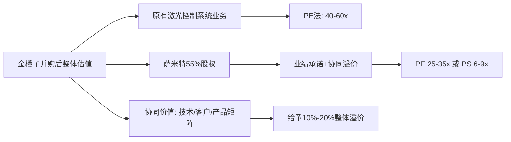

先把结论放前面：
- 并购萨米特如果顺利落地，金橙子从“激光振镜控制系统龙头”升级为“控制系统+高精密振镜/快反镜光机电一体化平台”，估值中枢理论上可以从现在约 40–60x PE 上移到 50–70x 区间。  
- 以当前约 47 元股价、2026 年券商预测净利约 0.9–1.0 亿元为基准，中性假设下并购成功、业绩兑现，合理市值区间大致在 50–65 亿元，对应股价约 49–63 元，比现价约有 5%–35% 的上行空间。  
- 乐观情形（协同超预期、估值给到 70x+）有 40%+空间；悲观情形（整合不力、业绩承诺不达预期、估值回落到 30–40x）可能还有 20%–30% 的下行风险。  
- 萨米特本身基本面是“小而美”的精密光学部件公司，毛利率、净利率都不错，但客户集中、军品/航发资质续期、现金流为负等问题比较突出，估值不算便宜（478% 增值率），商誉减值风险需要持续跟踪。
下面分块拆开说。
---
## 一、金橙子 & 萨米特：交易结构核心信息
### 1. 金橙子现状
- 业务：激光加工设备运动控制系统及部件，核心是激光振镜控制系统，2025 年收入 2.53 亿元，其中激光加工控制系统 1.83 亿元，占比 72.1%，是该业务国内龙头之一。
- 盈利：2025 年营收 2.53 亿元，同比 +19.46%；归母净利润 0.37 亿元，同比 +20.93%；毛利率 58.16%，净利率约 14.6%。
- 行业定位：振镜控制系统国内市占率领先，2020 年在激光振镜加工控制领域市占率约 32.29%，属于细分赛道“隐形冠军”。
- 估值：截至 2026 年 4–5 月，总市值约 44–49 亿元，对应 PE(TTM) 约 50–65x、PS 约 17–20x。
### 2. 萨米特（标的）基本面
- 业务：长春萨米特光电，专注精密光电控制产品，核心产品为快速反射镜（快反镜），并拓展高精密振镜等，下游覆盖航空探测、激光防务、激光通信、激光精密加工等，其中航空探测占比较高。
- 财务（截至 2025-12-31）：
  - 资产总额：1.14 亿元  
  - 净资产：0.56 亿元  
  - 2025 年营收：0.79 亿元  
  - 2025 年净利润：0.27 亿元  
  - 收益法评估：股东全部权益评估值 3.25 亿元，较账面价值增值 478%。
- 业绩承诺：2026–2028 年扣非前后孰低净利润分别不低于 3066.96 万元、3338.44 万元、3663.09 万元，三年合计约 1.01 亿元。
- 风险点（公告中披露较多）：
  - 客户集中度高，特别是航空探测领域；
  - 应收账款规模较大且持续上升，回款周期长；
  - 经营活动现金流持续为负（规模扩张快、科研院所客户回款慢）；
  - 军品/航空资质需要定期审查续期，若无法续期将影响业务；
  - 存在军品审价风险；
  - 收购将形成商誉，若未来业绩不达预期可能计提减值。
### 3. 交易结构
- 最新方案：金橙子以现金 1.79 亿元收购萨米特 55% 股权，不涉及发行股份及配套融资，不构成重大资产重组、关联交易或重组上市。
- 支付安排：60% 为前期收购款（协议生效后 5 个工作日内付 30%，剩余 30% 在约定条件满足后付清），40% 根据业绩承诺完成情况分期支付。
- 估值：55% 股权对价 1.79 亿元，对应萨米特 100% 股权估值约 3.25 亿元，与收益法评估结果一致。
---
## 二、并购成功后如何估值？——用“分部估值+协同溢价”的思路
### 1. 先看现有主业（不含萨米特）的估值锚
券商盈利预测（西南证券）：
- 2026 年：营收 3.16 亿元，归母净利润 1.04 亿元（含处置卡门哈斯 15% 股权的投资收益），EPS 1.02 元；
- 2027 年：营收 3.95 亿元，归母净利润 0.9051 亿元；
- 2028 年：营收 4.96 亿元，归母净利润 1.11 亿元。
不考虑并购，仅按现有主业给估值：
- 若给 2026 年 40–50x PE：对应市值 41.6–52 亿元；
- 若给 2026 年 55x PE（西南证券目标价对应 56.1 元，约 55x）：市值约 57 亿元。
这与当前 44–49 亿市值大致匹配，说明市场目前给的是“高成长细分龙头”的估值，但还没把并购协同充分定价。
### 2. 并购萨米特后：分部估值框架
用一个简化分部估值思路：

#### 2.1 原有主业：维持 40–60x PE 区间
- 金橙子毛利率 58%+、净利率 14%+，在垂直应用软件/激光控制系统里属于高盈利、高壁垒赛道；
- 同属激光控制系统的柏楚电子，当前 PE(TTM) 约 35–40x，但规模更大、增速更稳；
- 金橙子体量更小、成长性更高，给 40–60x PE 属于“龙头溢价+成长溢价”的合理区间。
#### 2.2 萨米特 55% 股权：参考“精密光学/光通信器件”可比公司
萨米特本质是高精密振镜/快反镜光学组件公司，可比公司包括：
- 炬光科技（688167）：上游激光光学元器件，当前 PS(TTM) 约 20–25x，PE 为负（短期亏损）；
- 光库科技（300620）：光通信器件+铌酸锂调制器，PS 约 20–40x，PE 约 300+x；
- 柏楚电子（688188）：激光控制系统龙头，PS 约 19–20x，PE 约 35–40x。
萨米特的特点：
- 规模小（营收约 0.8 亿），但净利率约 34%（0.27/0.79），盈利能力很强；
- 行业处于国产替代+军工/航天高景气阶段，增速和壁垒都不低；
- 但客户集中、现金流为负、军品审价与资质风险突出，不宜给到光库科技那种“AI 光互联核心资产”的极端估值。
综合来看，对萨米特 100% 股权：
- 合理 PE 区间：25–35x（对应 2025 年 0.27 亿净利，市值约 6.75–9.45 亿元）；
- 合理 PS 区间：6–9x（对应 0.79 亿营收，市值约 4.74–7.11 亿元）。
本次交易 100% 股权评估值为 3.25 亿元，相当于约 12x PE、4.1x PS，明显低于上述区间，说明评估相对保守，但增值率 478% 也说明账面净资产意义不大，核心是未来盈利和协同。
金橙子只买 55%，所以：
- 若按 PE 25–35x 给萨米特整体估值，55% 股权价值约 3.7–5.2 亿元，与交易作价 1.79 亿元相比，相当于金橙子用“折价”买到了一个高盈利光学资产（前提是业绩承诺兑现）。
#### 2.3 协同溢价：技术+客户+产品矩阵
协同点包括：
- 技术互补：金橙子的激光加工控制系统 + 萨米特的高精密振镜/快反镜，形成“控制系统+光学执行”一体化能力，有利于攻坚高端振镜、航空航天等应用；
- 客户互补：金橙子工业端客户为主，萨米特覆盖航空探测、激光通信等，客户重叠度低，可以双向导流；
- 产品矩阵：从“控制系统+系统集成硬件”扩展到“控制系统+核心光学部件”，提高单机价值量和粘性。
这类协同在A股通常会给 10%–20% 的估值溢价，尤其在军工+高端制造赛道。
---
## 三、乐观/悲观情形下的上涨空间测算
以 2026 年为基准年，假设：
- 金橙子原有主业净利润：0.9–1.0 亿元（剔除一次性投资收益后）；
- 萨米特 55% 股权贡献投资收益：按业绩承诺 2026 年净利润 3067 万元，55% 约 1687 万元，但并表后还有摊销、整合成本，简单按 0.15–0.2 亿元净利增量估算；
- 合并后 2026 年归母净利润：约 1.05–1.20 亿元。
### 1. 中性情形（基准）
假设：
- 合并净利润 1.10 亿元；
- 给予 50–60x PE（协同逐步兑现、估值略高于现有主业）；
- 对应市值 55–66 亿元，股价约 53–64 元（总股本 1.03 亿股）。
与当前约 47 元股价相比：
- 中性上行空间：约 +13%–+36%。
### 2. 乐观情形
条件：
- 萨米特业绩承诺超额完成（2026 年净利 4000 万+），同时金橙子在新领域（新能源锂电、光伏、半导体）放量；
- 军工/航天订单持续超预期，市场给到“军工+高端制造”估值溢价；
- 合并净利润 1.3 亿元，给 65–75x PE。
测算：
- 市值 84.5–97.5 亿元，股价约 82–95 元；
- 相比现价 +75%–+100%。
这是“情绪+业绩双击”的极端情形，需要非常强的宏观和行业配合。
### 3. 悲观情形
条件：
- 萨米特业绩承诺不达预期，客户/资质出问题，商誉减值；
- 金橙子主业受 3C 消费电子、制造业资本开支周期拖累，增速下滑；
- 合并净利润 0.9 亿元，市场只给 30–40x PE。
测算：
- 市值 27–36 亿元，股价约 26–35 元；
- 相比现价 -25%–-45%。
---
## 四、萨米特基本面到底怎么样？
优点：
1. 盈利能力强：2025 年净利率约 34%，远高于一般制造业；
2. 行业赛道好：快反镜、高精密振镜是激光雷达、激光通信、航空探测等高端装备的核心光学部件，国产替代空间大；
3. 技术壁垒：萨米特是吉林省专精特新企业、瞪羚企业，拥有快速反射镜、高精密振镜等核心技术；
4. 业绩承诺明确：2026–2028 年累计净利润不低于 9150 万元，给了一定安全垫。
需要警惕的点：
1. 客户集中：航空探测等少数客户贡献主要收入，一旦项目波动，业绩弹性大但风险也大；
2. 应收账款和现金流：经营现金流持续为负，应收账款规模大且回款慢，是军工/科研院所客户的典型特征，对资金链和减值都是压力；
3. 资质续期风险：军品/航空资质需要定期审查，一旦不能续期，部分业务可能无法继续开展；
4. 估值不低：3.25 亿元评估值对应 478% 增值率，虽然从 PE/PS 看并不离谱，但商誉减值风险需要持续跟踪。
整体看，萨米特是“高盈利、高壁垒、高客户集中、现金流弱”的典型军工/光学小巨人，并购协同逻辑顺，但执行风险不低。
---
## 五、A股可以对标的公司有哪些？
可以从两个维度看：  
1）激光控制系统/运动控制可比；2）精密光学/光通信器件可比。
### 1. 激光控制系统/运动控制可比
| 公司 | 代码 | 业务 | 估值参考（2026E） | 与金橙子差异 |
|------|------|------|-------------------|--------------|
| 柏楚电子 | 688188 | 激光切割控制系统龙头，中低功率市占率约 60%，高功率国产替代主力 | PE 30–40x，PS ~20x | 规模更大、盈利更稳，但主攻切割伺服控制，金橙子偏振镜控制 |
| 维宏股份 | 300508 | 运动控制系统+伺服驱动，覆盖激光、雕刻等多行业 | PE ~40–70x，PS ~6–7x | 业务更分散，激光控制系统体量明显小于柏楚，综合毛利率也低 |
金橙子与柏楚、维宏同属激光控制系统赛道，但：
- 金橙子专注于振镜控制系统（微纳加工），柏楚偏切割伺服控制系统（宏加工），维宏则更偏通用运动控制平台；
- 金橙子体量最小，但毛利率和成长性更高，估值应介于柏楚和维宏之间。
### 2. 精密光学/光通信器件可比（更接近萨米特）
| 公司 | 代码 | 业务 | 估值参考 | 与萨米特差异 |
|------|------|------|----------|--------------|
| 炬光科技 | 688167 | 上游激光光学元器件、微纳光学 | PS 20–25x，PE 当前为负 | 体量更大，上游光学元件为主，萨米特偏下游振镜/快反镜组件 |
| 光库科技 | 300620 | 光通信器件、铌酸锂调制器 | PE 300+x，PS 20–40x | 下游是数通/电信市场，AI 光互联溢价极高；萨米特偏军工/激光加工 |
| 瑞控信光电 | 未上市 | 快反镜、振镜、精密光机系统 | 非上市，无公开估值 | 产品结构最接近萨米特，但规模更小，属于非上市对标 |
萨米特与瑞控信光电产品高度相似（快反镜、振镜、精密光方向控制），但萨米特已经被金橙子收购，成为“平台型光学组件”的一部分。
---
## 六、给你的实操建议（思路，不是买卖指令）
1. **先盯交易是否真正落地**：目前方案是现金收购 55% 股权，不构成重大资产重组，但尚需股东会审议等程序。交易落地的确定性，是后续一切估值和空间的前提。
2. **重点关注萨米特业绩兑现节奏**：2026–2028 年业绩承诺是核心“安全垫”，如果 2026 年报显示扣非净利明显低于 3067 万元，要警惕商誉减值和估值下修风险。
3. **看金橙子自身主业的景气度**：3C 消费电子、新能源锂电、光伏等下游如果持续疲软，主业增速会打折扣，并购协同也会被拖累。
4. **估值区间比单点预测更重要**：当前股价已经在 40 多元交易，对应 50–65x PE，已经部分定价了并购预期。如果你的预期是“并购成功就翻倍”，需要非常乐观的假设；如果接受“5–35% 上行空间、同时承担 20–30% 下行风险”，则更接近中性情形。
5. **用分部估值跟踪**：把金橙子拆成“原有主业 + 萨米特 55%”，分别给 PE/PS 区间，再叠加协同溢价，比简单看一个市盈率要靠谱。
---
**总结一句**：  
金橙子并购萨米特，是在原本就不错的激光控制系统龙头基础上，补上“高精密振镜/快反镜”这一块核心光学能力，长期逻辑是顺的。但从估值和空间看，目前股价已经不算便宜，中性情形下上行空间约 10%–30%，乐观情形需要业绩和估值双击，悲观情形则要防范整合不力和商誉减值。建议你用“分部估值+业绩承诺跟踪”的方式动态调整预期，而不是简单看一个“并购成功就翻倍”的故事。
